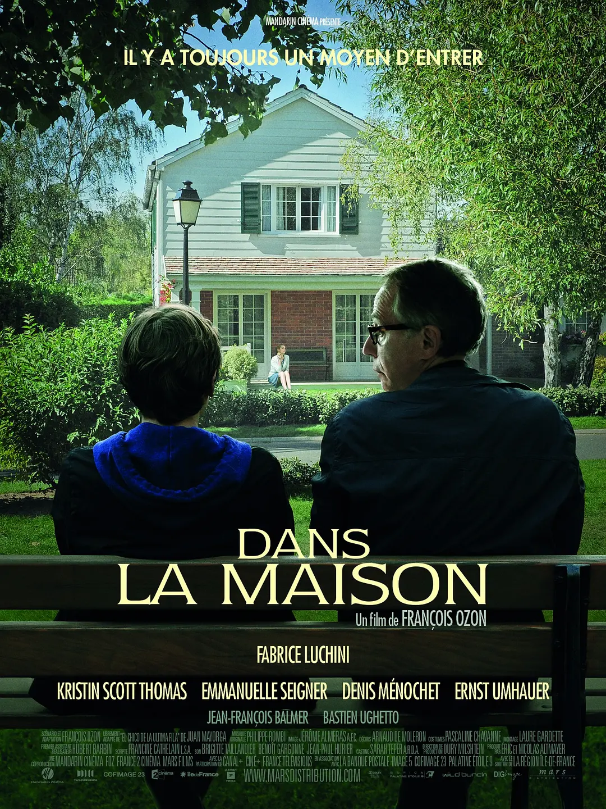

# 当剧情与现实交融

- 电影名：《登堂入室》
- 类型： 剧情 | 悬疑
- 评分：豆瓣评分 8.5，我个人评分可达 9 分 （满分 10）

> 有一段时间没有看电影了，主要是经费问题，而且最近电影院放送的电影质量真的说不上好（2023/11/10），所以趁着周末马上“查漏补缺”（毕竟我是悬疑爱好者）把《登堂入室》给看了。

## 故事梗概

故事的梗概大概就说了一个法语老师`吉尔曼`去到某个高中任职，某天布置了作业要求学生写周记，结果在家里批改这批周记时，发送学生们写的作业烂的离谱。 职业病（`吉尔曼`本身当作一阵子小说家）犯了一边向自己的老婆吐槽，一边批改这些作业，在他说出“他们是我遇到最差的学生”（经典台词）时，一篇周记吸引住了他的目光。在众多乏味的作业中`吉尔曼`意外发现 16 岁少年`克劳德`文章异常精彩,周记讲述了遇到自己同班同学(`拉斐尔`)放学后，他父母来学校接他放学，发现`拉斐尔`不忌讳这个父母来接，这种异于同龄人的情况，自己很想知道他的家庭氛围的故事。重点是，该篇日记最后写上了“待续”。 这个待续瞬间点燃了`吉尔曼`的兴趣。在课堂后它留下了`克劳德`稍微讲了一下它的日记用词错误和叙事手法上的缺点后，没想到`克劳德`再次提交了一份作业。 他的作业是关于偷窥——讲述他如何潜入朋友家中、窥探对方一家生活的故事，以及如何一步步下套追求`拉斐尔`的母亲，`吉尔曼`被字里行间深深吸引，熄灭已久的文学激情亦被点燃。他不但决定单独辅导才华横溢的`克劳德`、鼓励他放手创作，还与妻子`珍娜`一同分享`克劳德`的作文。然而成年人在阅读过程中竟渐渐忘记了虚构和现实的边界，为了让`克劳德`能继续潜入`拉斐尔`的家（此时`克劳德`帮助`拉斐尔`辅导数学）甚至去偷了考试试卷的答案，最后因为`拉斐尔`告发了`吉尔曼`偷试卷的行为，以及`克劳德`的作业的影响下，`吉尔曼`与`珍娜`的矛盾爆发，`吉尔曼`最后一无所获。

如果你没有看过这个电影，单从梗概来说，会认为这部电影是老师辅导潜力无限的学生，同时欣赏他的文章的所产生故事的剧情片。 我认为这是一个比较浅的看法，当前“有一千的观众，就有一千个哈姆雷特”,[豆瓣](https://movie.douban.com/review/5803923/)这个观众的看法也非常新颖，有见解，有兴趣可以看一下。

我的观后感会认为这是"两个小说家对小说（现实）情节的创作"的故事， `克劳德`问过`吉尔曼`学生有那么多，你为什么只辅导我一个。 `吉尔曼`说道："你有我没有才华，你会成为成功的小说家，而不是像我这样。"，每一个在成为小说家指甲，它必然是读者。 `吉尔曼`在`克劳德`的日记中看到了自己不层拥有的才华，以及有趣的情节~~偷窥果然是人类最原始的兴趣~~，虽然`克劳德`的叙事手法有的生疏，不够连贯，但只要加以辅导，必然会成为优秀的小说家，那么第一个读到作品的读者，必然是幸福的。 随着不断的辅导`克劳德`,`克劳德`的叙事手法越发高超，甚至开始挑战了 `吉尔曼`的控制，有一个场景，是`吉尔曼`不满足当前故事没有”矛盾点“，它认为`克劳德`应该要制造矛盾点，让小说剧情来个峰回路转，但`克劳德`认为过早不想这样做，但`吉尔曼`忍不住了，某个课堂上让`拉斐尔`当着全班份上朗诵自己的日记（日记标题是《我最好的朋友-克劳德》），残忍且羞辱让`拉斐尔`与`克劳德`制造矛盾点，`克劳德`非常不满这种行为，他用从`吉尔曼`所学的叙事手法向“教育委员会”举报了这个事情，为`吉尔曼`带来不少的麻烦，但后面还是依旧为`克劳德`辅导。 看过非常多小说的我，在这里能深刻感受到，这是两个作者对剧情创建的分歧，但就算有分歧，他们都已经“入迷”了，陷入了这本“小说”的创作中。

`克劳德`不断的深入`拉斐尔`的家中，逐渐蚕食`拉斐尔`在家里的地位，在`吉尔曼`的教导通过强烈的叙事手法开始模糊了现实的边界。 每次`吉尔曼`向自己的伴侣`珍娜`分享`克劳德`日记内容时，他都会自欺欺人或者自信的说这是小说创作而已。 某天`克劳德`写着：“某天晚上，我辅导拉斐尔太晚了，他的父母让我当晚住下，我获得了他父母的关心。我比拉斐尔更加优秀，我懂他父亲的爱好，我喜欢他母亲，没人能注意到他母亲的痛苦，我注意到了，我更适合当他们儿子。早上我想叫拉斐尔起床，发现他自杀了。 待续” ，`吉尔曼`这个时候大惊，他害怕了他和`克劳德`的创作逼得一个少年自杀了，马上跑去教室发现`拉斐尔`没来，去教导住打电话得到原来`拉斐尔`只是感冒病请假了，`吉尔曼`这个时候才松了一口气，他也发现了`克劳德`的羽翼已经丰满，他的才华结合自己的辅导，小说的剧情已经突破了现实。 他马上向`克劳德`表示自己不会再教他了，也不会再读他的文章了，`克劳德`表示非常生气，扔了日记就走，但`吉尔曼`还是读了。

`克劳德`最后接日记映照了`吉尔曼`和他伴侣`珍娜`的矛盾，`吉尔曼`和`拉斐尔`的父亲非常相识，都陷入自己的事业而忽视了自己的伴侣，最后的一篇日记在强大的叙事手法上，`吉尔曼`发疯的家暴`珍娜`一直说你和他上床了吗，后面也因为偷试卷和这个事件，`吉尔曼`最后一无所获。

## 有你一起创作的剧情，才是我的小说

`克劳德`是真的喜欢`拉斐尔`的母亲吗？ 我觉得并不是，他只是沉迷了小说创作，忠于角色的行为。 毕竟小说的剧情就是讲述了“我”如何潜入`拉斐尔`的家，一步步追求她母亲。 `吉尔曼`和`克劳德`说不再教导你了，`克劳德`非常生气说：“为什么，是你让我创作的，我已经喜欢上了我剧中的人物”，侧面说明了`克劳德`并不重视`拉斐尔`的母亲，他重视的剧情的发展与自己塑造下人物的行为准则，以现实为蓝本，用高超的手法加以故事的描绘。但当`吉尔曼`意识到`克劳德`的小说已然突破现实边界，他害怕`克劳德`会为了剧情逼得出一些很夸张的事情发现，他决定不参与这个剧情的创造（从后剧情读日记的过程中，`吉尔曼`逐步参与了剧情的创作）。`克劳德`这是不允许的，虽然作者是自己，但这部小说必然要由老鼠参与进来，所以他让偷事件暴露，他也料定了`吉尔曼`会分享给枕边人，反衬引爆`吉尔曼`与他伴侣的矛盾。让老师`吉尔曼`一无所有，老师`吉尔曼`的才华只能有我占据。

表面故事其实一般，但讲述得实在精彩，不仅将故事张力无限放大，还有种扑面而来的章回小说的阅读感，现实和故事的相互介入令人着迷。开头和结尾构图的呼应挺有用意，就好像那些快速闪动的证件照片，你不禁想按下暂停指着眼前的一幅说：不如就从这个故事开始吧。

最后一无所有的`吉尔曼`坐在公寓外的长凳上，`克劳德`找到了他，他们一起坐着长凳上，`克劳德`对`吉尔曼`说对面两个拉拉在吵架，`吉尔曼`看了看他，那不是“拉拉”说是双胞胎；

- `克劳德`： 你怎么知道是双胞胎呢？
- `吉尔曼`： 你怎么知道是"拉拉"？

他们有默契的为那两女人的吵架配上台词，但台词互不关联，`克劳德`以拉拉为视角，`吉尔曼`以双胞胎的视角。他们成为窥视的共谋者，心智相投，对视一笑。我们总能找到方法，进入别人的生活。公园的座椅，教室的最后一排，最好的位置，你能看到所有人，所有人看不到你。剧情的创作，介于我所想所见，万物皆有故事点。

故事有趣正是如此。

待续
