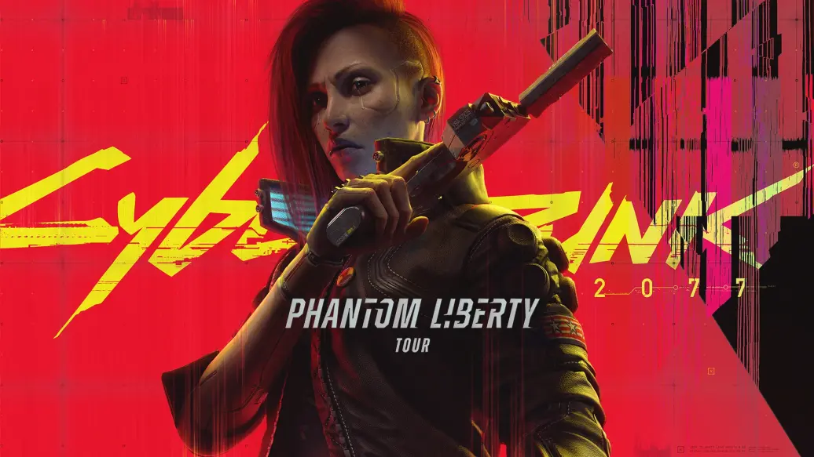

# 《赛博朋克 2077 - 往日之影》 完全体的 2077 体验

---

在大概历经 20 小时后，终于把`《赛博朋克2077 - 往日之影》`DLC 正式通关了，虽然说往日之影是`赛博朋克`游戏下的一个大型 DLC，但我更想称呼为这是在最小程度下阉割后的`完全体《赛博朋克 2077》`，这才是这个游戏的本该一开始拥有的形态。
暂时把倒退到 2020 年 12 月 09 日,在经历了几轮跳票后，终于定档了最这一天发售。在官方之前的好几个“高质量”的实机演示下，外加本身又是神作`《巫师3 - 狂猎》`的开发商，带来非常夸张的狂热气氛，我甚至记得当时我还特意向公司调休了一天，就是为了能够玩到这款游戏。 期待值直接拉满，毕竟我相信波兰蠢驴懂得如何讲好一个故事，我在`《巫师3 - 狂猎》`中体会的故事，到现在我写这篇文章还历历在目，而且实机演示下各种炫酷的义体定制、爬墙暗杀、深度的剧情演出，电影级别的全中文配音...，每一个点都能刺激到肾上腺素的飙升。 最后在游玩的过程中，也确实能体会到波兰蠢驴在“如何讲好一个故事”做的十分出色，每一个人物生动形象，但存在非常多的灾难问题：

- 它的 BUG 实在太多了。

有一个有趣的事情，剧情中有一段是`V`被`德肖恩`爆头，然后被`竹村`找到了我们，后面发生了车辆战斗，`竹村`叫我们拿枪在车上射击敌人，当时我玩这一段的时候全程黑屏，当时我还不认为是 bug,还在赞叹波兰蠢驴真写实，`德肖恩`把我`岐路司`打爆了所有我看不见东西。后面看了别人游玩才知道我碰上了 BUG。 如果你说这个 bug 不影响剧情体验的话，那么一些任务的阻塞 BUG 就十分恼火，在`赛博精神病 - 血腥仪式`的任务中，由于我并不是从正门进来，我是通过二段跳从任务点的后面进入，导致了这个任务无论如何都没办法触发完成（前置的信息都已经扫描，冰箱的 BOSS 就是不出现），它的 bug 要说可以说一天。

- 它太多东西阉割了。

阉割最为深刻就是爬墙暗杀以及黑敌人标记同伙位置，当时 48 分钟那个实机演示，看到`V`扫码敌人后，该敌人连接的局域网下的全部敌人通过一个后很炫酷的展示方式标记了所有敌人，然后一个帅气的爬墙暗杀掉另一个同伙，太震撼了，然而当实际游玩的时候，根本是做不了这个动作的，黑敌人的效果变成了一些攻击手段。 同时还有枪械自主系统，到后续发现能自主搭配不同配件的东西非常少。 我是一个非常注重剧情体验的玩家，当演示看到`V`去在车上接`德肖恩`的任务那个过场时，非常的有代入感。 中文配音以及炫酷的过场动画说明，让你只要有心玩，你甚至可以不用看任务提示，就能知道自己干嘛~~（往日之影一些关键任务回归了这种模式，加强了代入感）~~。但过了`德肖恩`后一些大型的任务，也就是对话-选择-结束说明这种流程，虽然在超高的中文配音加持下下，还是能做到夸张的代入感，但是还是差点意思。

所以波兰蠢驴的口碑一下就崩盘， 但抛开一开始夸张的期待值和那些烦人的 bug，依然可以很负责的说`赛博朋克2077`是一个神作级别的游戏。延续了`《巫师3 - 狂猎》`论如何讲一个好故事的操作，波兰蠢驴在讲故事的方面值得任何一家游戏厂商学习和借鉴。（比如这次 DLC 的权杖结局，历历在目，太精彩太感概...）, 那么这次 DLC 带来的完全体`赛博朋克2077`算是强势的扭转了发售前期那糟糕的口碑，最重要的是来自 DLC`往日之影`那精彩结论的剧情演出。

::: danger 剧透提示
下列信息有大概率会剧透，酌情阅读。
:::

## 夜之城活阎王化为 007

DLC 剧情一开始是从接到神秘电话开始，叫我们去`狗镇`大门，然后`Relic`突发故障，DLC 女主角`百灵鸟`也出现`Relic`中，相信我百灵鸟登场的那一刻会十分让你震撼，如果你已经通过你会觉得`奥特`这种顶级黑客已经很强了，那么`百灵鸟`的登场会刷新了你对赛博朋克黑客的理解，她强势的让`银手`从`Relic`中暂时下线，强势的换上自己，顺带优化了`Relic`的缓存~~（新的技能天赋）~~，在它指导下我们到达了新的区域`狗镇`，在爬上`狗镇`的天台时，一发地对空导弹击中了总统飞船，也碰巧把`V`的落脚点弄踏了，也预示了这个 DLC 正式的开启。

这次的剧情就是从`V`要去营救新美国总统`罗莎琳德·迈尔斯`开始，在营救出来后，发现绰号`百灵鸟`的`宋昭美`并没有相约在约定地点汇合（`Relic`连接也在对付大型机甲兵器“奇美拉”中断），初步估计是被`狗镇`老大`库克尔·汉森`抓住，为了营救`百灵鸟`，`迈尔斯`提供了电话号码叫`V`去找昔日联情局特工`所罗门·李德`，同时也把`V`登陆注册为联情局特工的故事。

随着剧情的发展，越来越多隐藏在往日的因果不断的拉出，原来`所罗门·李德`被联情局狠狠背刺了一把，联情局把他当成了筹码和公司交易，但`李德`非常的忠心，哪怕被国家背刺了，它还是忠于国家，当我们找到`李德`,和`罗莎琳德`见面的时候，`李德`也仅仅是抱怨了几句，但还是马上组织安排`罗莎琳德`离开`狗镇`。

介于在`狗镇`，`汉森`强大的势力份上，不得不找多点人力，这个时候就找到了联情局另一名特工`亚历克斯`， 到此，往日的因缘不断浮现出来。 `李德`透露，其实`百灵鸟`，`亚历克斯`多年以前都是一个小队的，当时候就背刺的执行人就是`百灵鸟`，`百灵鸟`是受到了`罗莎琳德`的命名下的手。 而`百灵鸟`却是这次事件的开端，她是事件的策划者。而为什么`罗莎琳德`一定要救`百灵鸟`，是因为`百灵鸟`是`罗莎琳德`（或者说是`军用科技`）主导下的人形移动核弹，`百灵鸟`是触碰`黑墙`的黑客，`罗莎琳德`想要用`黑墙`的力量制衡`荒板`。

一夜，`百灵鸟`告诉`v`，她能感受到`v`对生命的渴望（`Relic`不断侵蚀着`v`的生命），也欺骗`v`的歉意，她只是想活着，`狗镇`挖出了能救`v`和她自己生命的神经矩阵，她表面答应`汉森`就是为了获取这个救自己，她触碰了`黑墙`,精神不断的被`黑墙`蚕食。 她想要逃离来自`罗莎琳德`的控制，想要自由，她并不想当成兵器。

她对`v`深情的表示，现在的她其实已经“死了”，在她黑了`军用科技`19 岁那年被`李德`找到，那一天开始就已经死去，她不断的被改造，不断的被逼做一些事情。 （剧情中`李德`也多次对`v`说很内疚，把`小宋`（`百灵鸟`）带到了一个不属于她的世界，不断的被逼做一些事情，特别内疚没有人能在关键的时候帮助她）。 她恳请`V`帮助她，配合她把神经矩阵拿出来后，协助她逃离现场，逃离`罗莎琳德`的控制，然后神经矩阵治疗好自己，也同时治好`V`,而另一方面`李德`则请求你把`百灵鸟`救出，同时带回来。`李德`相信只有`新美国`能拯救`百灵鸟`，并且`李得`收到得命令也是要带回`百灵鸟`.

任务到了`审判日`，`V`就会面临结局分支选择按照`百灵鸟`计划还是选择`李德`的计划。

## 放走了一只囚鸟

我这里选择按照`百灵鸟`的计划，当按照`百灵鸟`的计划后，强大的黑客能力就展现出来，黑掉了整个系统让`亚历克斯`轻松的杀掉了`汉森`，黑飞机，黑炮塔不在话下，但`百灵鸟`也越发的虚弱，这个时候走路都开始缓慢了起来，瞳孔也越发泛着红光（`黑墙`的侵蚀越发的严重）。 在一阵战斗逃脱下，`百灵鸟`和`V`逃离了`联情局`和`汉森手下`的包围，成功逃了出来。`百灵鸟`和`v`说再定约定地点。

这个时候`李德`也会打电话给`V`，双方算是走在对立面了，`李德`不满`v`带走了`百灵鸟`，说只有新美国才能拯救`百灵鸟`，而`v`则说`百灵鸟`想要自由，你对新美国的忠诚喂狗去吧。

后续，当`百灵鸟`找到了`v`，得到的消息是要去月球，去没有`联情局`的地方。但哪里能想象到`联情局`对于`百灵鸟`这个顶级武器的拥有欲，派出了成吨的兵力就是为了抢回`百灵鸟`。（最后火车一站，成吨成量的兵力），终于开一顿激战后，`百灵鸟`为了逃离包围圈，只能再次连接`黑墙`，`V`这个时候也连接了`百灵鸟`，代她通过`黑墙`黑掉武装直升机、各路敌人。 （这里可以看出`黑墙`的威力恐怖，任何敌人都是直接秒杀，而且感染`黑墙`者表情极其痛苦）。终于、终于`百灵鸟`和`V`上了去往航天火箭的火箭，`百灵鸟`这个时候极其虚弱，接近死亡，这个时候她开始很内疚和`v`透露其实她一直利用了`v`，神经矩阵只能救一个人，她选择了自己，她不想死，也不想做为一件武器存活。 哭诉着她是不是有更好的选择，一个不用死那么多人，不用互相利用他人的方式活下去。 这段演出极其精彩和真情流露，明明为一个人利用了，但此刻身为`v`玩家的我，并不想这个时候责骂她（选择的第二都是抱怨），反倒是安慰她了起来，最后火车到了，`百灵鸟`已经没有体力行动了，`v`将`百灵鸟`抱住，一步步走向航天飞船。

但这个时候，`李德`从航天飞船的门慢慢走出，他要求`V`现在把百灵鸟交给他；

“我不想杀你，李德！” 这句台词在强大的代入感下，仿佛是我自己的自白，`李德`绝对不是一个坏人，他是`夜之城`中少有的全面型正派角色，虽然他下手果断（枪杀两个黑客），但是他真实的为了国家，为了自己信念行动下去，他真心为了`百灵鸟`着想。

李德： “我其实很想知道 V,她当时为什么找的人是你，而不是我”

V: "宋昭美说，她能和我感同深受，我们两个都是掐着表过日子的人。"

`李德`不再过多了交流，只求`v`把`百灵鸟`交给他（这里是再次是结局分支线），我选择开枪击毙李德，最后把`宋昭美`带到了航天飞船，让`百灵鸟`成功逃离了`联情局`，她不再被当成一件兵器而活着。

## 感概

剧情大概如上述所说的，这是`v`(玩家自身)卷入`百灵鸟`为了自救所创造的故事，`百灵鸟`为了自己活下来和逃离当成兵器的命运，利用了`联情局`，`v`, `狗镇汉森`三方甚至多方势力，她只是活下去，黑墙不断侵蚀着她。

`李德`的忠诚贯穿了整个剧情，前面也说了`李德`是少有的有情有义的人，哪怕是以前行动受到了背刺`百灵鸟`下的手，在听到`百灵鸟`被困狗镇，他还是毅然决然去拯救她，反而把责任都揽到自己身上，他内疚那个时候没有在关键时候帮助`百灵鸟`，而且他最后时候并不想杀掉`v`，在最后决战中，留了几秒时间给`v`反应，`V`最终才能杀掉`李德`。 （当然你要是死不放下`宋昭美`，李德还是会枪杀`v`），对于`李德`来说，这何尝不是一种解脱呢，`李德`身陷忠义不能两全的困境，他深知`百灵鸟`回去也只是一件兵器，就是自己把`百灵鸟`当成人看，那上面怎么看待，`李德`改变不了局面，不过真如那句台词一样，"我不想杀你，李德"，夜之城从此少了一个真正的好人。 而`百灵鸟`呢？讲真，一点都对`百灵鸟`提不起恨意，有的时候为了自己，不择手段有什么错，在`夜之城`这种地方，利自有什么错，只是最简单想活下去，想做为一个人活下去，而不是做为一件兵器。 火车的对话中，`百灵鸟`问`v`，我的选择是错的吗？会出现更好的选择吗？ 我当时觉得你的选择是对的，没有对错可言，在`夜之城`真正能和`v`感同身受只有是`百灵鸟`了。

银手也说了，百灵鸟一条黑道走到底，不管她会不会成功，她起码不忘初心了，起码知道自己的目标是什么。因此百灵鸟骗了我，但如果没有如同魄力，如何才能脱离来自`联情局`的控制，这种为了自由愿意付出一切代价的努力，真的，很有感染力。

结尾处，抱起奄奄一息的`宋昭美`，叹一口气：“还是我来照顾你吧，我一定送你上月球。”
只有保持自我的`V`才可以做出这样的抉择，和`百灵鸟`的坚持不懈可谓是相呼应。在这一刻，不仅`百灵鸟`值得`V`和`银手`由衷的钦佩，`V`自己也会佩服自己，这是很了不起的。

- “嗨，这又不是一次两次了，大不了我们再想其他办法。”
- “V，有时候我是真的佩服你的生活态度。”
- “干得好，飞吧，你这只鸟儿自由了”
- “得，这下咱俩又得苟在一起了（笑）。”
- “哎哟卧槽（笑）”。

飞吧，你现在已经是一只自由的百灵鸟了。
