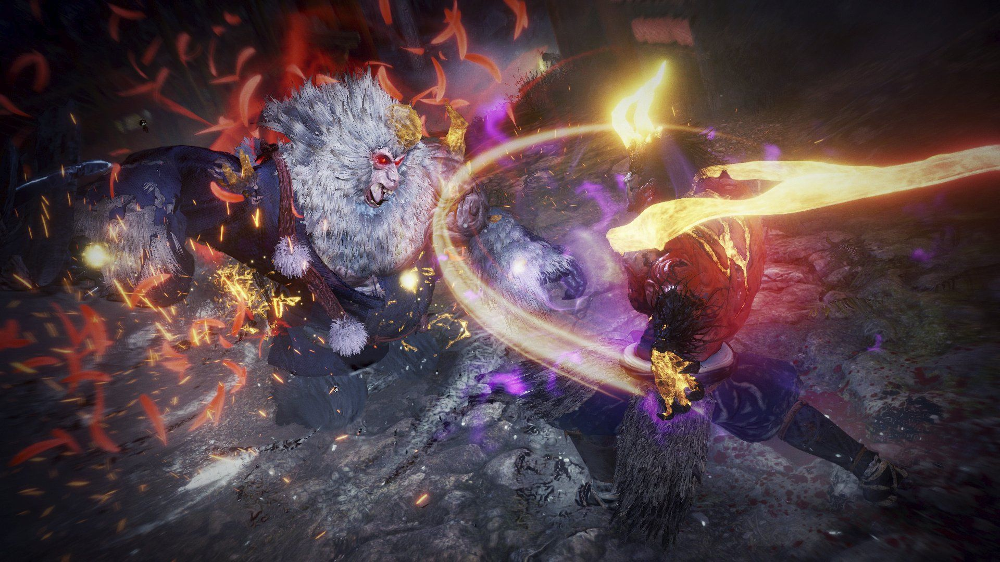

# 《仁王 2》 一款极具爽快的魂类动作游戏

> 我觉得《仁王 2 》就是《仁王 1 》的超级大型 DLC

不严谨的说目前市面上的魂类游戏有两种，第一种就是“宫崎英高”和抄“宫崎英高”作业类型的，这一类游戏在面对 BOSS 的时候大多属于“二人转”，既你并不能通过花里胡哨的出招来解决面前极具强大的 BOSS,它只能一招一式，看破对面每一次的出招，利用“翻滚”的短暂无敌帧抓住 BOSS 可以攻击的间隙来打倒它。另一种就是“忍者组”开发的魂类游戏，它在面对 BOSS 的时候你可以通过自己一顿华丽的操作，在看破 BOSS 出招的同时完成一系列攻击、跑位，极具高速的动作魂类游戏。两者都是魂，忍者组恰恰利用了"宫崎英高"式的动作元素不足，来凸显了属于自己独树一帜的魂系。

都说到了高速动作的元素，仁王的高速动作体现了出招以及行动的“残心（精力条）”，仁王的攻击并不是简单的轻攻击和重攻击这一简单的组合，它被细致的分为上、中、下架势，每一个架势都有轻攻击和重攻击，不同招式需要根据轻 + 重或者轻 + 翻滚搓招施放，更有技能需要轻 + 切换架势 + 轻等一系列的指令完成施放，这简直是一个天才的设计，它完美的扩展了动作元素，相信我当你熟悉了后你会在肌肉记忆的帮助下快速精准的搓招，它并不难。在使用任何攻击动作都会产生精力消耗，这和大部分魂类游戏一致，但仁王中很聪明的在使用了攻击动作后，它会马上生成一个虚拟的回复精力的情况，这个时候可以按下残心键马上获得这虚拟回复的精力并且让精力正常回复，这一动作仁王定义为残心，如果虚拟回复刚好达到了刚刚动作所消耗的精力时残心，则称为“完美残心”，这就很有操作可言了，操作者每一个动作都可以考虑在普通残心和完美残心上做抉择，是需要不断的追击在动作结束后就残心（这样就会回复一点点的精力）还是追求精力源源不断但需要额外的停一下的完美残心，结合残心过程中还可以切换段位达到“流转”等，都一一构建出仁王的极具高速动作的元素，更别说仁王每一把武器都有着不同的玩法，同一把武器的出招指令并不绑定任何段位，这里举例双刀的风神，你只能在下中段使用，太刀各个段位丰富的指令，都告诉了要品尝仁王的玩家一个信息，“换一把武器，就等于是从零开始”，所以仁王极具多周目性，而且并不太会让你觉得困倦，在你熟悉后，每一次战斗每一次残心，见招拆招都会让你肾上腺素狂飙。

为了防止和 BOSS 进行二人转，仁王 2 中还引入了“妖反”这一机制，每一个敌人都会有一个强大的杀招，在出现这个杀招的时候都会泛红光，这个时候你只需要在它杀招将要打中的瞬间按下“妖反”技即可对怪造成大范围的硬直效果，这极其大程度增强了动作性以及防止二人转，仁王的系统方方面面都鼓励了你去进攻，它强调进攻才是最好的防御，你并不需要一直二人转行为去背词敌人，以及本作新增了可以获得打败后敌人的“魂核”，可以使用打败过的敌人的技能，多样性的魂核技能组合以及妖怪技更丰富了战斗的过程。

但仁王 2 也有缺点，这一缺点甚至在忍者组后续开发的《卧龙》也完美的继承了下来，就是它的装备管理系统简直你可以用烂来形容，我的背包在后期塞满了各式各样的装备，武器暂且不说，就单论防具，防具在游戏里的种类非常多，有一些可以组成套装效果，但如果是在二周目和一周目，可以这样说大多数的散装就是一个分解材料，但它实在是太杂了，不好管理，甚至三周目后，简单的说其实你防具还是穿那几件，所以大多数都会沦为分解或者供奉材料，但它的管理方式又过于粗糙，导致我后期干脆就不捡蓝装和黄装了，很是恼火，我认为装备管理可以再精细一点，防具的散件真的太多了。另外仁王 2 在中期就开始堆怪特别的严重，在中期路上的小怪和精英怪基本上都是前面已经出现的类型，给人的感觉就是排除 BOSS，无非就是换了一个地图箱庭。另外有一点略显遗憾的是这一代的主角还是没有“膝盖”，它不能“跳”。这里并不是吐槽仁王 2 的地图设计，反而时而觉得仁王 2 中的地图箱庭有一些做的非常的精妙，让我印象特别深刻是与妖怪化柴田胜家那个地图，当我转了几圈后发现还是这个复活点，会产生：“哦，原来这个地图是这样的构造的轻叹感”，但略显遗憾地图的精度如何能往纵向延伸就好了，很多情况下仁王的纵向延伸都是通过“梯子”实现，但感觉这里还可以加入“跳”来丰富地图的构建。

仁王的动作元素非常的丰富，仁王 2 在丰富的基础上额外增加了妖怪技和妖反，加速了动作元素，说实话除了猫头鹰那关，每一个 BOSS 都让我肾上腺素飙升。我可以通过精湛的操作来击杀 BOSS，我并不需要一直二人转一直反馈。但仁王的堆怪以及装备管理确实问题很严重，但它不妨碍它依旧是一款好玩的动作魂类游戏，它区别了宫崎英高类的魂，独树一帜的魂，仁王 2 依旧可以配得上 9 分（满分 10）的神作。
