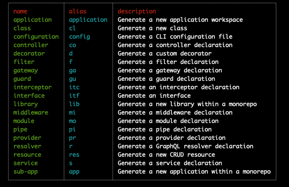

# 入门

`egg.js`、`express`、`koa2`都是优秀的`node`框架，但是后两个这种处理请求响应的库并不能约束代码的写法，代码可以写的很随意，所以不适合开发大型项目。而`egg.js`和`nest.js`都是企业级框架，它对一些写法上有很明确的约束，属于“约定大于俗成”的一类，为什么在中国啃`nest.js`而不去啃`egg.js`呢？更多的原因是因为要走出舒适区而且`nest.js`的 stars 足足有 65k（截止写稿日期），它实在是太火了（虽然是国外），但又有谁能阻挡前端工程师“觉醒”成为 node 全栈工程师呢？

## 注意事项

:::tip 先决条件
`nest.js`需要操作系统有`node`且当前`node`的版本要大于 v16

```bash
node -v
```

:::

在满足了先决条件后，就可以类似`vue-cli`全局安装脚手架来快速创建`nest.js`应用。

```bash
pnpm i -g @nestjs/cli

nest new 项目名
```

:::tip 提示

不过`nest.js`社区现在非常活跃，版本迭代会比较的快速，可以关注官方文档的版本号进行更新脚手架.

```bash
pnpm update -g @nestjs/cli
```

:::

当上述都完成后，`nest -h`就可以按看到`nest`的 cli 工具的命名帮助。

## 初始化项目 (nest new 或 n)

初始化项目:

```bash
nest new <name>
```

特别的,通过`nest new -h`帮助手册可以知道，创建项目的时候还可以额外的加一些参数，它分别是：

- `--skip-git` 或 `-g` ： 跳过 `git` 的初始化
- `--skip-install` 或 `-s`： 跳过 `install`
- `--package-manager` 或 `-p`： 选择什么样包进行下载， 第一次会让你选择，如果选择后默认都会使用改选择进行下载
- `--langguage` 或 `-l`：语言，默认 `ts`
- `--strict`： `Ts` 严格模式

## 启动 (new start)

`nest`启动和大多数项目类似，只需要通过如下命名就可以将项目跑起来:

```js
nest start

// 或

pnpm run start

```

启动虽然也有很多参数，但常用的就只有`--watch`与`--debug`。

- `--watch`：热加载模式，当启动了热加载模式后，当保存了`.ts`与`.js`文件后，它会自动编译重新启动。
- `--debug`：调试模式。

## 快速生成模版 (nest generate 或 g)

`nest.js`的 cli 工具提供了丰富的快捷生成模版的功能，它能快速的生成日常工作中需要的模版（比如说 serice、module、controller, 日后 nest 在创建模版这一方面都有快捷命令），并且会自动（可以设置）完成在项目入口文件`app.moduel.ts`的注入。

创建模块：

```bash
nest generate modeul <modeulName>
```

当然也可以缩写为：

```bash
nest g mo <modeulName>
```

创建服务：

```bash
nest generate serice <sericeName>
```

当然也可以缩写为：

```bash
nest g s <seriveName>
```

在平常的工作中，CURD 可能是大部分的日常，`nest.js`的 cli 这里很贴心的提供了一键创建 REST API 风格的模版，只需要输出如下命名即可

```bash
nest generate resource <resourceName>
```

当然也可以缩写为：

```bash
nest g res <resourceName>
```

与此类推，cli 工具能创建日常工作中所需要的模版，具体可以使用`nest g -h`查看的支持面板。



它同样也支持参数，常用的分别为：

- `-d` 它会在控制台输出改动的情况，方便确定我们这条指令创建/改变了什么文件
- `--spec` 与 `--not-spec` 前者是需要创建对应的测试用例（默认），后者为不需要创建对应的测试用例
- `--skip-import` 是不更新引入关系(指`app.moduel.ts`中的 improt)
- `--flat` 与 `--not-flat` 前者是需求生成文件夹（默认），后者则反之。 举个例子，`nest g co testco --flat` 就只会在当前目录下生成名为`testco`的`controller`，如果选择`--not-flat`则会生成`testco/testco.controller.ts`
