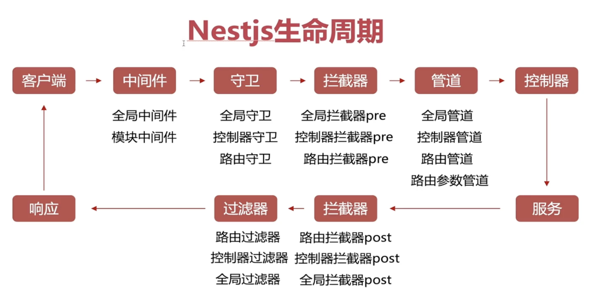

# 守卫 Guard

守卫是一个使用 `@Injectable()` 装饰器的类。 守卫应该实现 `CanActivate` 接口。

守卫有一个单独的责任。它们根据运行时出现的某些条件（例如权限，角色，访问控制列表等）来确定给定的请求是否由路由处理程序处理。这通常称为授权。在传统的 `Express` 应用程序中，通常由中间件处理授权(以及认证)。中间件是身份验证的良好选择，因为诸如 `token` 验证或添加属性到 `request` 对象上与特定路由(及其元数据)没有强关联。

简单的来说，守卫就是再访问各个路由前去校验授权的一系列操作。

:::tip 优先级
守卫在每个中间件之后执行，但在任何拦截器或管道之前执行。
:::



## 创建与基本结构

`NestCli`工具提供了非常简便的创建方法。

```bash
nest g gu guard/xxx
```

基础结构：

```ts
// guard.ts
import { CanActivate, ExecutionContext, Injectable } from "@nestjs/common";
import { Observable } from "rxjs";

@Injectable()
export class MosGuard implements CanActivate {
  canActivate(
    context: ExecutionContext
  ): boolean | Promise<boolean> | Observable<boolean> {
    return true;
  }
}
```

最终返回一个布尔值，如果为`true`则被使用的类会继续执行下去，如果为`false`则中断当前逻辑。用法与拦截器等类似，可以分为全局守卫、控制守卫、方法守卫，

## 使用

控制守卫 & 方法守卫统一使用`@UseGuards`装饰器进行使用；

```ts
@UseGuards(MosGuard)
class xxx {
  // 业务逻辑
}
```

全局则需要在`main.ts`构建的时候使用`app.useGlobalGuards`进行全局守卫。

```ts
// main.ts
import {xxx} from guard.ts
app.useGlobalGuards(xxxx)
```

当然守卫可以支持多个，多个的时候有多种写法；

```ts
@UseGuards(Guard1)
@UseGuards(Guard2)
class x {}
```

想要支持多个只需要额外的新增一个`@UseGuards`装饰器即可，但特别强调的是如果采用上述写法，**守卫的执行顺序将从下往上**，即守卫`Guard2`先运行，后再`Guard1`，这和一般阅读的代码习惯稍微有点出入。所以对于习惯前端的使用者来说，采用逗号隔开或者能更得心应手；

```ts
@UseGuards(Guard1， Guard2)
class x {}
```

采取上述写法就可以从左往右依次执行。
