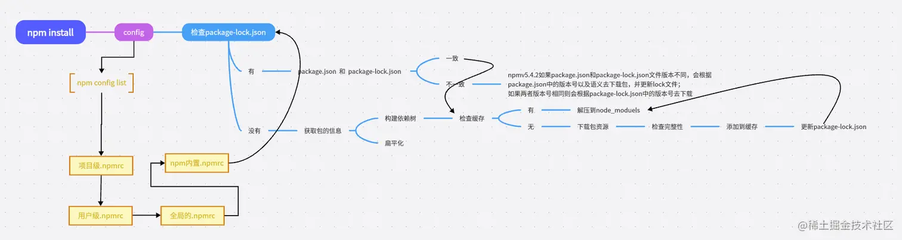

# Npm install 原理

首先安装的依赖都会存放在根目录的 node_modules,默认采用扁平化的方式安装，并且排序规则.bin 第一个然后@系列，再然后按照首字母排序 abcd 等，并且使用的算法是广度优先遍历，在遍历依赖树时，npm 会首先处理项目根目录下的依赖，然后逐层处理每个依赖包的依赖，直到所有依赖都被处理完毕。在处理每个依赖时，npm 会检查该依赖的版本号是否符合依赖树中其他依赖的版本要求，如果不符合，则会尝试安装适合的版本。

但它并不是真正意义上扁平化，扁平化只是在理想的状态，比如说下图:

安装某个二级模块时，若发现第一层级有相同名称，相同版本的模块，便直接复用那个模块，因为 A 模块下的 C 模块被安装到了第一级，这使得 B 模块能够复用处在同一级下；且名称，版本，均相同的 C 模块。

那么非理想的情况则如下：

因为 B 和 A 所要求的依赖模块不同，（B 下要求是 v2.0 的 C，A 下要求是 v1.0 的 C ）所以 B 不能像 2 中那样复用 A 下的 C v1.0 模块 所以如果这种情况还是会出现模块冗余的情况，他就会给 B 继续搞一层 node_modules，就是非扁平化了。

## npm install 后续流程

## package-lock.json 的作用

- version 该参数指定了当前包的版本号
- resolved 该参数指定了当前包的下载地址
- integrity 用于验证包的完整性
- dev 该参数指定了当前包是一个开发依赖包
- bin 该参数指定了当前包中可执行文件的路径和名称
- engines 该参数指定了当前包所依赖的 Node.js 版本范围

package-lock.json 帮我们做了缓存，他会通过 name + version + integrity 信息生成一个唯一的 key，这个 key 能找到对应的 index-v5 下的缓存记录 也就是 npm cache 文件夹下的。
