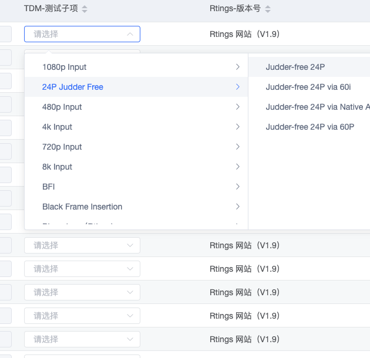

# 一个“夸张”的表格内嵌级联下拉选择需求

> 先说需求，产品的需求在一个【不分页】表格的每一行中嵌入一个级联下拉框（光根节点就有 100+）。



需求上用户想要触发编辑的时候对表格的某一个单元格的数据通过级联下拉框进行编辑，很合理的需求，但问题出在于这个表格它并不分页，以及级联下拉框的数据量太多了，如果直接往表格中的每一行都添加一个级联下拉框，那么势必会让整个表格在拖动与编辑的时候极其的卡顿。

我: 这里很卡，能让用户接受这个页面这个表格分页吗？

产品：用户说不行，也不接受卡顿

我： nmd.....

## 解决方案

产生卡顿的直接原因是因为 DOM 太多了，浏览器没办法即时渲染，这里无论用了表格行拦截与否对于那夸张数据量级的级联下拉框 DOM 也是有一定延迟的，这样会造成操作或者渲染有粘滞感。那么核心的解决思路还是要减少级联下拉框的 DOM 数。

针对这个解决思路，一般情况如果一个数组的每一项都是可以编辑的，在`vue`的情况下通常会生成一个数组并且使用索引进行`v-for`绑定。

```vue
<input v-for="(item, index) in list" :key="index" v-model="use[index]" />
```

那么产生卡顿是因为级联下拉框的数据量太多了，那么完全可以简单让绑定级联下拉框的`list`只有一个，类似于上述`v-model`，又能监听是否展开和收起级联下拉框.

```vue
<input v-for="(item, index) in list[index]" :key="index" v-model="use[index]" />
```

只需要在其某个索引下单元格的级联下拉框展开的时候，往该索引下的级联下拉框绑定一个`list`，同时又在收起的时候，如果没有选中则删掉这个索引下级联的`list`，如果选中则删除原本的`list`，同时生产一条只有选中的`list`（既选中了叶子结点，则拼接成级联所需的格式，变相与删除非选中的全部节点）。当然这里把前作者没有懒加载这个没分页表格的漏洞给加上。

下面是实现的具体代码(cascaderTemplate 为 el-cascader 级联下拉框绑定的 options, tdmList.value.list 为级联下拉框所需要绑定的数据)：

```vue
<script lang="ts">
// ----------- 特别强调 ------------------

/**
 * @description 解决表格应大数据量的级联组件导致卡顿臃肿
 * @function focusCascderTemplate 选中了cascader
 * @function changeCascderTemplate 离开了cascader
 * @implements 本身Tables绑定的el-cascader组件，因为数据量太多了（tdmList.value.list）2000+条，现改变思路
 * 1。获取表格数据的时候， Array.from({ length: tableData.value.length }, () => []) ， 跟随表格长度生成一个长度一致的数据维表，这个数组用于渲染不同row.index的【级联组件】
 * 2. 即根据【1】让表格组件每一个row的el-cascader绑定的数据不再是一个长度夸张的数组，谁获取焦点既绑定谁
 * 3. 当离开了cascader时候，再对离开的这一个row的el-cascader绑定它的“只选中的那一条数据”。
 * 4. 总结来说，就是夸张的树状数据只有在changes的时候填充到对应索引的row,离开的时候只保留它选中的数据，没有选中则空数组
 */
/**
 *  @description 选中了cascader (术式顺转 苍)
 *  @param {number} index 当前行索引
 */
const focusCascderTemplate = async (index) => {
  cascaderTemplate.value[index - 1].splice(
    0,
    cascaderTemplate.value[index - 1].length
  );
  cascaderTemplate.value[index - 1] = cloneDeep(tdmList.value.list);
  await nextTick();
  proxy.$forceUpdate();
};

/**
 * @description 离开了cascader（术式反转 赫）
 * @param {any} row 操作行
 * @param {any} fItme 选中内容节点树
 */
const changeCascderTemplate = async (row, fItme) => {
  const index = row.index;
  cascaderTemplate.value[index - 1].splice(
    0,
    cascaderTemplate.value[index - 1].length
  );
  cascaderTemplate.value[index - 1] = cloneDeep(fItme);
  await nextTick();
  proxy.$forceUpdate();
};

/**
 * @description 展开钩子函数  (虚式 芘)
 * @param {boolean} event 展开 ｜ 收缩
 * @param {any} row 操作行
 */
const visbleChange = (event, row) => {
  if (event) {
    focusCascderTemplate(row.index);
  } else {
    // 这里会存在一个时间差，既选中速度低于关闭速度，所以触发回调双向绑定需要使用异步事件
    setTimeout(() => {
      if (row.tdmRelationship.length && Array.isArray(row.tdmRelationship)) {
        const fItme = recursionFilterateObj(
          tdmList.value.list,
          row.tdmRelationship,
          "testItemId",
          {
            type: true,
            index: 0,
          }
        ); // 拼接一个伪装的数组，不然v-model没办法回显
        changeCascderTemplate(row, fItme);
      } else {
        // 没选清空 （索引需要减少1）
        cascaderTemplate.value[row.index - 1].splice(
          0,
          cascaderTemplate.value[row.index - 1].length
        );
      }
    });
  }
};

// ----------- 特别强调结束 ------------------
</script>
```
