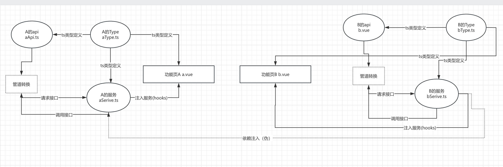
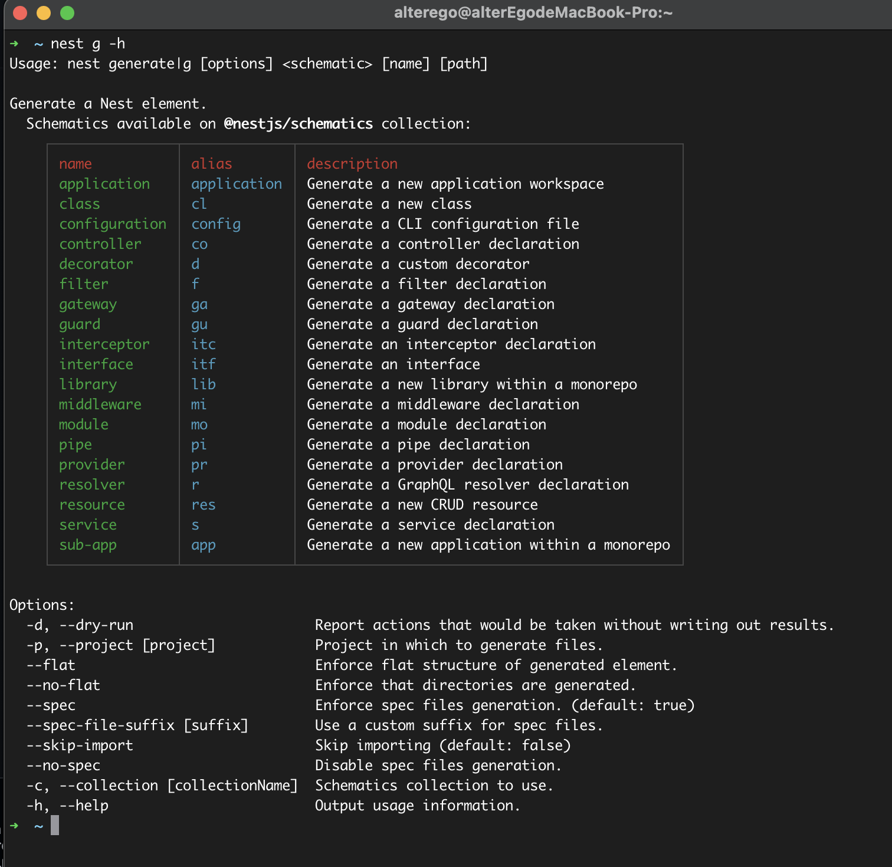
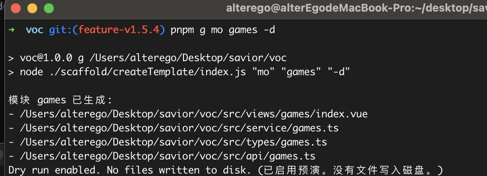

# 前端伪 Mvc 架构与脚手架生成模版

开篇先简单理解一下什么是应用分层， 举个例子：比如说打一个游戏，你的背包有武器和材料以及魔法卷轴等等，在初期量少的情况下很容易管理和运用，但当出了新手村背包也有了各色各样的东西，如果你要锻造某个武器，这个武器需要 xx 素材,xx 素材又需要 xx 卷轴才能生成，单从背包寻找并且运用是一件恶梦的事情，为此才会有了材料区、装备区、卷轴区。程序也是一个道理，项目刚起步的时候请求少，页面与页面的互联基本没有，但顺着代码不断的增加，刚好这个时候有一个需求需要使用之前上个迭代的功能，那么摆在面前无非就是封装和复制，复制是一种非常 low 的办法，但封装属于改动类，所谓代码写得不好就是改一处牵动全身，项目后期互联的依赖，逻辑的不明晰，意义不明的封装都是一个非常耗费时间的东西。

那什么是 Mvc? MVC 即 Model-View-Controller（模型-视图-控制器），是一种软件工程中广泛使用的架构模式，主要用于简化用户界面的开发，尤其是在 Web 应用中。MVC 模式将应用程序的业务逻辑、用户界面和控制流程分离，以便于独立管理和维护每个部分。

MVC 各组成部分：

- Model（模型）：负责管理应用程序的数据和业务逻辑。它直接与数据交互，比如从数据库获取数据或保存数据到数据库。
- View（视图）：负责展示数据给用户。它是用户与应用程序交互的界面，通常是由 HTML、CSS 和 JavaScript 组成的网页。
- Controller（控制器）：作为模型和视图之间的桥梁，它接收用户的输入并调用模型和视图完成数据的更新和显示。控制器不直接操作数据或渲染视图，而是协调这两者。

搞后端的能其非常熟悉，但前端相对来说会对其概念会薄弱一点，毕竟 Vue.js 本身并不严格遵循 MVC 模式，而是采用了类似但有细微差别的 MVVM（Model-View-ViewModel）模式。

但并不妨碍借用其思想来伪一个对应的开发流程思想。

> 需要强调，我认为流程或者说框架不存在唯一解，适合当前自己的项目、能减少重复代码、简单易懂才是可行之道。正所谓写诗要学白居易，老太婆也能看得懂。

## 这下要从 Hooks 说起

在前端开发领域，“Hooks”特指一种用于函数式组件的功能性扩展，最初是由 React 团队引入的。Hooks 提供了一种无需编写类组件即可使用 React 的状态和其他特性的方式，使得函数组件能够拥有与类组件相同的能力，同时保持代码的简洁和可复用性。Vue 3 引入了 Composition API，这是一组 API，其设计灵感来源于 React 的 Hooks。Vue 的 Composition API 允许开发者在一个组件中集中管理状态和逻辑，从而提供更好的可读性和可复用性。在 Vue 中，Hooks 通常是指以 use 前缀命名的函数，它们封装了特定的逻辑或状态管理。

道理都懂，但在实践的情况下来说，很容易能把 Vue3 当作 Vue2 来写（对，说的就是我），有时候可能出于这块不需要封装目前没有复用、产品经常改封装个毛、项目寿命也就半年不想废脑写 hooks、技术力不够想不到较好的封装思路...等等，这些都阻碍了对页面的逻辑的整合行为，哪怕尤神（尤雨溪，vue 的创始人）文档所提及的 Vue3 的 Composition API 要解决 Vue2 混沌的逻辑布局，但现实是绝大数（起码在我现在公司里，我也是）都不自觉的“梭哈”写功能。这个时候就需要使用 Mvc 的思想，来做一种基准的、不喧宾夺主的、也浮夸为了封装而封装的、方便后续需求抽筋要扩展、能逻辑服用解藕的开发流程。

## 从 Nest.js 吸取灵感

`Nest.js`是一款 node.js 的后端继承框架，它受到 MVC（Model-View-Controller）架构的影响，但是 Nest.js 的架构设计更为灵活和模块化，因此它不仅仅限于传统的 MVC 模式。Nest.js 引入了自己的一套概念，包括 Controllers、Providers 和 Modules，这些概念可以与 MVC 中的概念相映射，但同时也扩展了功能和灵活性，Ok，基于这点不妨先抽象一下，Controllers、Providers 和 Modules 能对应 Vue 开发流程中的哪一部份。我觉得可以这样理解：

- Modules - 对应了 Vue 的页面（毕竟它可以做为页面也可以做为组件）
- Controllers - 对应了获取远端数据的行为
- Providers - 对应了远端服务

稍加整合，就可以让 Vue 的开发流程变成把 Modules 与 Controllers（当然这是不严谨的说法），这里单独把对远端请求的逻辑和服务抽离出来，做到【页面或组件】只关心当前自身的交互逻辑，而数据则通过【服务】进行提供。

```vue
<template>
  <div></div>
</template>
<script setup lang="ts">
import { getGames } from "./serive";

const {} = getGames(); // ---> 提供后端返回的数据
</script>
```

这不就是简单把请求逻辑给换了一个位置？是的，就是简单的把请求稍微挪了一个位置封装成了一个黑盒，本质技术并没有复杂和难的技巧点，现实就是很简单的，但这一小步带来是更加解藕的操作，我觉得可以分为几个场景和方面：

### 依赖注入（伪）

在`Nest.js`中服务是可以被注入的，讲人话就是这块逻辑能复用。开篇也说了，项目后期经常有可能会遇到新页面的逻辑和之前写的页面的逻辑一摸一样的情况，那就封装和复制二选一。 那么按照上述所说的，把请求的逻辑给抽离出来，ok，先让上述的抽离出来的请求转化为`hooks`，我们就定义一个游戏的【服务】, 并且这个服务中有请求列表的操作。

```ts
import { ref } from 'vue'
import { gamesListRowType } from '@/types/games'
import { getGamesList } from '@/api/games'

// gamesService
export const useGamesService = (config) => {
  const gamesList = ref<gamesListRowType[]>([])  // 游戏列表

  const gamesParams = ref({ name: '' })  // 获取游戏列表的参数

  /**
   * @description 获取游戏列表
   */
  const toGetGamesList = asnyc () => {
    const result = await getGamesList(gamesParams.value)
    // ...逻辑
  }


  return {
    gamesList,
    gamesParams,
    toGetGamesList
  };
};
```

ok，本体页面我们就引入它。

```vue
<template>
  <div></div>
</template>
<script setup lang="ts">
import { useGamesService } from "@/service/gamesService";

const { gamesList, gamesParams, toGetGamesList } = useGamesService(); // 载入服务
</script>
```

ok，现在就完成了上述一个标准的流程，那么后续有新的页面需要使用这个服务的功能，都可以不必重复写一遍代码。因为它是`hooks`也相当于可以注入到另外的【服务中】去，假设现在有另一个【服务】需要获取游戏列表(在实际项目中经常有这种鬼事);

```ts
import { getGamesList } from "@/api/games";
export const fnA = () => {
  const { gamesList, gamesParams, toGetGamesList } = useGamesService(); // 载入游戏的服务

  // 那么在当前模块中，就能使用游戏【服务】中的全部逻辑
};
```

又因为它是`hooks`可以往其传入一些参数，来各种丰富对该服务的一些行为进行控制，比如是否需要触发生命周期等(`useGamesService({init: false})`)，后续只需要在服务中对这个传入参数进行个性化配置即可。

这样就相当于完成了一个解藕，让该事件脱胎于页面，后续其他页面也能使用或者依赖于这个方法。同时上述的操作都不会在页面上进行（当然也可以的），`gamesList`与`gamesParams`都因为是`ref`所以它具有响应式，页面只专注与页面的交互逻辑，而服务只关心服务的逻辑。

### 对返回数据的绝对定义

身为前端，免不了和后端打交道，都会遇到后端返回的格式或者命名或者字段值都不符合前端既拿既用，我们需要【转】一层，这点类似`Nest.js`的`pipe`管道的思想，既在 Controllers 对输入参数和返回参数进行一个优雅的转换,比如不喜欢后面返回字段的命名我们要 label 而不是 name、'1'转 1 等等等，那结合上述的抽离出来的服务(hooks)，这一步操作就可以整合到内部进行完成；

```ts
import { ref } from 'vue'
import { gamesListRowType } from '@/types/games'
import { getGamesList } from '@/api/games'
import { transformGamesPipe } from '@/pipe/games'

// gamesService
export const useGamesService = (config) => {
  const gamesList = ref<gamesListRowType[]>([])  // 游戏列表

  const gamesParams = ref({ name: '' })  // 获取游戏列表的参数

  /**
   * @description 获取游戏列表
   */
  const toGetGamesList = asnyc () => {
    const result = await getGamesList(gamesParams.value)
     gamesList.value = transformGamesPipe(result) // 管道转换

    // ...逻辑
  }


  return {
    gamesList,
    gamesParams,
    toGetGamesList
  };
};

```

ok，现在无论返回的还是给后端的（最经典莫过于时间组件选择器，前端需要数组，后端需要逗号隔开的字符串），都可以根据我们`管道`进行转化。

### 获取用户列表【服务】

我觉得不可能有前端没有写过下拉框远端搜索获取用户列表的需求，如果抽离成服务（也可以说是 hooks，在我这里定义为它是全局服务），那么将直接干掉千篇一律的代码，只需要把服务引入，将参数绑定在下拉框，搜索事件绑定下拉框搜索事件即可瞬间完成需求（要个性化还可以提供参数传递选择）。

```ts
]import { ref } from "vue"
import { vocGetUserList } from '@/api/account'


export const useUser = () => {
    const userList = ref<{ email: string, loginName: string, name: string, id: string }[]>([])

    const searchUser = async (keyword?: string) => {
        if (keyword === '') return
        try {
            const result = await vocGetUserList({ pageNum: 1, pageSize: 100, name: keyword })
            const list = Array.isArray(result.list) ? result.list : []
            userList.value.splice(0, userList.value.length, ...list)
        } catch (err) {
            userList.value.splice(0, userList.value.length)
        }
    }

    return {
        userList,
        searchUser
    }
}

```

现在可以大声说一句：我受够了一切繁文缛节了！（指项目中没人封装获取用户列表的组件，并且我不想主动封装，因为这接的需求还要对这个下拉框做独特的个性化操作的我写了一遍又一遍的获取用户列表，然后看着其他同事也写了一遍又一遍的获取用户列表），现在无论个性化与否，核心的参数绑定和事件都可以通过服务来处理。

最后贴一张目前的开发流程划分模块图：



## 好流程必须要自动化

无论是为了依赖注入和解藕方法事件，核心的本质就是让“页面专注于页面干的事情，服务专注于服务干的事件，服务可以被互相注入，功能拆分清楚”。但可能你也注意到了，因为现在额外做了一层拆分服务，那么一个页面的结构就会变成，index(本体)、serive（服务）、api(一般我们都会把 api 封装成一个文件)、type（Vue3 是 ts,那么 Ts 定义文件也肯定会有），当然组件的情况不纳入考虑范围内，相当于现在接到一个表格需求，基准需要创建四个文件，并且这四个文件互联引入，同时还需要定义其命名遵守约定的规范，特别是 hooks 的命名有一个成文的约定我们需要加一个`use`做为开头，但哪怕遵守了这个约定，还是可能存在人与人之间命名的不同，比如 useName 与 useTitle 但文件夹是 useName。

为什么？并不是同事之间不遵守约定规范，是人类本性就是趋于“惰性”，如果每一个流程都需要重复十个相同的步骤，并且这个步骤必须从 a->b->c 依次进行，人类在进行了几次后就会对该流程感到厌烦和忘记，为此“约定大于配置”的框架多少都要解决这个问题，不然约定则是一张白纸。

还是从`Nest.js`吸取灵感，`Nest.js`虽然在国内反应平平，但在国外它属于最火的 node.js 框架，`Nest.js`也是属于“强约定”的框架，但它提供了强大的 cli 工具，能自动快速的创建对应的模版文件并且处理引入对应的文件中（简单的说就是快速创建控制器、服务、模块，并且能自动往入口文件中 import 对应的路径）。



## 利用 commander 与 fs 自动化创建流程模版

首先分析一下`Nest.js`是怎么创建模版的，当在命令行输出对应的创建命令比如说`nest g mo games`它就会在 src/games 创建一个 games.module.ts (没有 games 文件夹也会创建一个 games 文件夹) 并且预填充模版内容（内容可自定义）。

```ts
import { Module } from "@nestjs/common";

@Module({})
export class GamesModule {}
```

本质上该功能就是一个解析命名后再做项目写入对应的文件，ok 那么实现起来也不复杂，这里可以借助`commander.js`(这是极其好用的宝藏库，搞`lerna`的时候发现了它，强烈大家收藏)解析对应输入的命令，同时解析后，就可以通过 node 的 fs 对其进行逻辑判断以及文件写入。

首先先按照一下 commander 的库：

```bash
pnpm i  commander
```

### 获取解析并且注册方法

然后我们创建一个 js 的入口配置文件，`commander`的用法非常简单，需要引入其中的`Command`然后实例化，就可以快速创建一个命令。

```js
const program = new Command();

const { Command } = require("commander");

// 描述
program
  .name("pnpm run g")
  .description("voc 模版脚手架 v1.0.0")
  .version("1.0.0"); // 这里描述了对应的启动方式、说明、以及版本
```

紧接着注册一个方法，通过实例化的`command`定义方法的命名，`alias`为别名，以及`description`描述，`action`为本次事件，它回调中的`moduleName`为`command`定义的参数，既`module <moduleName>`的 moduleName，

```js
// 定义方法
program
  .name("pnpm g")
  .description("voc 模版脚手架 v1.0.0")
  .version("1.0.0");
  .command("module <moduleName>")
  .alias("mo")
  .description("Quickly create voc development templates (快速创建voc开发模版)")
  .action((moduleName) => {
    console.log(moduleName)
  });

  program.parse();

```

随后把该方法添加到`package.json`中，现在`pnpm g module games`，log 就能输出 games。

```js
// package.json
    "scripts": {
        "g": "node ./scaffold/createTemplate/index.js"
    },

```

### 完善逻辑

现在获取命名后的参数工作已完成，现在填充一下逻辑，先创建需要的模版文件，然后引入。 模版是字符串，但我们这里可以转化为函数 return，这样就可以接收一个参数来让模版更加丰富（主要是为了 moduleName，让文件名统一）。

api 模版：

```js
// api 模版文件
const getApiTemplate = (moduleName) => {
  if (!moduleName) throw new Error("没有模版名");

  return `
import request from '../plugins/axios';
import type {} from  '@/types/${moduleName}';

`;
};

module.exports = getApiTemplate;
```

服务模版：

```js
const getSeriveTemplate = (moduleName) => {
  if (!moduleName) throw new Error("没有模版名");

  return `
import { onMounted , onActivated } from 'vue'
import {} from  '@/api/${moduleName}'
import type {} from '@/types/${moduleName}'

export const use${moduleName}Service = (config: {init?: boolean}) => {


    onMounted(() => {
        if (config.init) {}
    })

    onActivated(() => {
        if (config.init) {}
    })

    return {

    }
}
    `;
};

module.exports = getSeriveTemplate;
```

本体模版：

```js
const getVueTemplate = (moduleName) => {
  if (!moduleName) throw new Error("没有模版名");

  return `
<template>
    <div>

    </div>
</template>

<script setup lang="ts">
import { defineOptions } from 'vue'
import { use${moduleName}Service } from '@/service/${moduleName}';
import type {   } from '@/types/${moduleName}';

// 外部暴露组件名
defineOptions({
    name:  '${moduleName}'
})


// 载入${moduleName}服务
let {} = use${moduleName}Service({init: true})

</script>

<style scoped lang='less'>

</style>
`;
};

module.exports = getVueTemplate;
```

顺后就非常简单了。通过 node 的 path 拿到项目对应所在电脑的地址，然后通过 node 的 fs 在对应路径写入对应文件即可。

```js
/**
 * @description 快速生成voc开发模版 （脚手架增强）
 * @author 叶锦荣
 */

const fs = require("fs-extra");
const path = require("path");
const { Command } = require("commander");

// 载入模版
const getVueTemplate = require("./tep/vueTemplate");
const getSeriveTemplate = require("./tep/serviceTemplate");
const getApiTemplate = require("./tep/apiTemplate");

const program = new Command();

// 描述
program
  .name("pnpm run g")
  .description("voc 模版脚手架 v1.0.0")
  .version("1.0.0");

// 定义方法
program
  .command("module <moduleName>")
  .alias("mo")
  .description("Quickly create voc development templates (快速创建voc开发模版)")
  .action((moduleName, options) => {
    // 项目路径
    const projectRoot = process.cwd();

    try {
      // 模版 template
      const vueContent = getVueTemplate(moduleName);

      // 服务 Service
      const serviceContent = getSeriveTemplate(moduleName);

      // 类型 Type , 目前对类型没有固定形式
      const typeContent = ``;

      // api 请求列表
      const apiContent = getApiTemplate(moduleName);

      // 创建moduel文件夹 且 写入文件
      const dirPathModule = path.join(projectRoot, "src/views", moduleName);
      const moduleTep = `${dirPathModule}/index.vue`;
      if (!fs.existsSync(dirPathModule))
        fs.mkdirSync(dirPathModule, { recursive: true });
      if (!fs.existsSync(moduleTep))
        fs.writeFileSync(moduleTep, vueContent, "utf8");

      // 写入service
      const serviceTep = path.join(projectRoot, `src/service/${moduleName}.ts`);
      if (!fs.existsSync(serviceTep))
        fs.writeFileSync(serviceTep, serviceContent, "utf8");

      // 写入type
      const typeTep = path.join(projectRoot, `src/types/${moduleName}.ts`);
      if (!fs.existsSync(typeTep))
        fs.writeFileSync(typeTep, typeContent, "utf8");

      // 写入api
      const apiTep = path.join(projectRoot, `src/api/${moduleName}.ts`);
      if (!fs.existsSync(apiTep)) fs.writeFileSync(apiTep, apiContent, "utf8");

      console.log(`模块 ${moduleName} 已生成:`);
      console.log(`- ${moduleTep}`);
      console.log(`- ${serviceTep}`);
      console.log(`- ${typeTep}`);
      console.log(`- ${apiTep}`);
    } catch (err) {
      console.log(err, "err");
    }
  });

program.parse();
```

输入`pnpm g module games`，就可以看见`games`就已经自动生成。减少了繁杂重复的创建以及偏写重复千篇一律的代码，并且这样命名也统一，方便后续的维护。

最后，添加文件敏感操作，因为之前也说过`command`是支持参数的，也就是平常命令中的`-h`、`-v`，这里也学`nest.js`支持一个`-d`，`-d`指是预览变化，让操作者可以预览文件生成的路径，但是不马上去添加文件，给使用者一种检测的机会。只需要实力中注册一个`option`即可，然后把回调`action`中的`options`抛出来即可。

完整代码：

```js
/**
 * @description 快速生成voc开发模版 （脚手架增强）
 * @author 叶锦荣
 */

const fs = require("fs-extra");
const path = require("path");
const { Command } = require("commander");

// 载入模版
const getVueTemplate = require("./tep/vueTemplate");
const getSeriveTemplate = require("./tep/serviceTemplate");
const getApiTemplate = require("./tep/apiTemplate");

const program = new Command();

// 描述
program
  .name("pnpm run g")
  .description("voc 模版脚手架 v1.0.0")
  .version("1.0.0");

// 定义方法
program
  .command("module <moduleName>")
  .alias("mo")
  .option(
    "-d, --dry-run",
    "Report actions that would be taken without writing out results. (报告将要采取的行动而不写出结果)"
  )
  .description("Quickly create voc development templates (快速创建voc开发模版)")
  .action((moduleName, options) => {
    const isDryRun = options.dryRun;
    // 项目路径
    const projectRoot = process.cwd();

    try {
      // 模版 template
      const vueContent = getVueTemplate(moduleName);

      // 服务 Service
      const serviceContent = getSeriveTemplate(moduleName);

      // 类型 Type , 目前对类型没有固定形式
      const typeContent = ``;

      // api 请求列表
      const apiContent = getApiTemplate(moduleName);

      // 创建moduel文件夹 且 写入文件
      const dirPathModule = path.join(projectRoot, "src/views", moduleName);
      const moduleTep = `${dirPathModule}/index.vue`;
      if (!fs.existsSync(dirPathModule) && !isDryRun)
        fs.mkdirSync(dirPathModule, { recursive: true });
      if (!fs.existsSync(moduleTep) && !isDryRun)
        fs.writeFileSync(moduleTep, vueContent, "utf8");

      // 写入service
      const serviceTep = path.join(projectRoot, `src/service/${moduleName}.ts`);
      if (!fs.existsSync(serviceTep) && !isDryRun)
        fs.writeFileSync(serviceTep, serviceContent, "utf8");

      // 写入type
      const typeTep = path.join(projectRoot, `src/types/${moduleName}.ts`);
      if (!fs.existsSync(typeTep) && !isDryRun)
        fs.writeFileSync(typeTep, typeContent, "utf8");

      // 写入api
      const apiTep = path.join(projectRoot, `src/api/${moduleName}.ts`);
      if (!fs.existsSync(apiTep) && !isDryRun)
        fs.writeFileSync(apiTep, apiContent, "utf8");

      console.log(`模块 ${moduleName} 已生成:`);
      console.log(`- ${moduleTep}`);
      console.log(`- ${serviceTep}`);
      console.log(`- ${typeTep}`);
      console.log(`- ${apiTep}`);

      if (isDryRun)
        console.log(
          "Dry run enabled. No files written to disk. (已启用预演。没有文件写入磁盘。)"
        );
    } catch (err) {
      console.log(err, "err");
    }
  });

program.parse();
```

效果：


