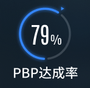

# Echarts 绘制特殊圆环图的需求

先直接看需求，需求是需要使用 Echarts 绘制出下图的圆环。



需要注意是：

- 数据是从底部（圆的 90 度）开始逆时针充盈。
- 如果没有数值没有大于等于 100，则数据的结尾处会连接一个灰黑色的背景条，且这个灰黑色的背景条与数据条会有空白间隙。
- 数据的结尾会存在一个倒三角沿着数据条径向排布
- 中间需要显示数值，底部显示指标名

---

## 组件设计

从需求上来说，难的还是关于圆环部分。 其他基本属于简单，根据实际情况，为了最大化复用组件，组件只接受`name`(指标名)与`value`(指标值)，获取数据交给外围组件，自身组件只负责把数据与名称显示出来即可。

```ts
interface {
    name: string
    value: number
}
```

## 空白间隙难题

官方例子中，是有给出环图渲染空白间隙的情况的，不过例子中使用的是描边，但当前需求的背景是渐变的，不适用当前的情况。 可能有人会说描边不是可以透明色吗？ 对的，描边是可以透色色，但这样就和没设置描边一样效果，所以也不行。

那么为了解决间隙问题，这里还是需要`pie`，但这里稍微做一点小操作，把间歇与灰黑色条都当成数值即可，通过传入组件的`props.value`来加以动态计算出间隙与灰黑色条的数值。

```js
// 图表初始化配置
 const series:  [{
        zlevel: 2,
        startAngle: 270,
        name: '',
        type: 'pie',
        radius: ['78%', '90%'],
        avoidLabelOverlap: false,
        legendHoverLink: false,
        itemStyle: {
            borderRadius: '50%',
            borderColor: 'transparent',
            borderWidth: 3,
            opacity: 1
        },
        emphasis: {
            disabled: true
        },
        labelLine: {
            show: false
        },
        label: { show: false },
        left: 5,
        top: 5,
        right: 5,
        bottom: 5,
        data: [
            {
                value: 100,
                name: '',
                itemStyle: {
                    color: '#3586fb',
                },
                label: {
                    show: false
                }
            },
            {
                value: 0,
                name: 'Direct',
                itemStyle: {
                    color: 'transparent'
                },
                label: {
                    show: false
                }
            },
            {
                value: 0,
                name: 'Direct',
                itemStyle: {
                    color: '#3b4752'
                },
                label: {
                    show: false
                }
            },
            {
                value: 0,
                name: 'Direct',
                itemStyle: {
                    color: 'transparent'
                },
                label: {
                    show: false
                }
            },
        ]
    },
 ]
```

动态计算可以根据需求自行调配比例，现在我这里获取数值的占比后，通过`100 - 占比`得出剩余的区域，然后灰黑色条占剩下的 8 分之 10，余下则被间隙填充（间隙是有两个的）。当然如果数据大于或者等于 100 的时候，需要多一些额外的操作，不显示灰黑条与间隙。

```js
/**
 *  @description  动态绘制
 */
const drawChart = () => {
  let value = Number(data.value) * 100;

  let residue = 100 - value;

  let ash = residue * (8 / 10); // 灰色设定为10分之八

  let white = residue * (1 / 10); // 间隔空白 每个占10分一

  ringConfig.value.series[0].data[0].value = value;

  ringConfig.value.series[0].data[2].value = value === 0 ? 100 : ash; // 如果是超过100%，不显示

  if (value !== 0 || value < 100) {
    ringConfig.value.series[0].data[1].value = value === 100 ? 0 : white / 2;
    ringConfig.value.series[0].data[3].value = value === 100 ? 0 : white / 2;
  }
  if (value === 0) {
    ringConfig.value.series[0].data[1].value = 0;
    ringConfig.value.series[0].data[3].value = 0;
  }
};
```

## 倒三角标识

这里引用图表叠加，在`echarts`中，类型为`pie`能与`gauge`叠加使用，既然`pie`无法绘制数据图表，这里把绘制“倒三角”的工作交给`gauge`的指针，同时把圆环的`value`交给仪表盘，这样就可以让“倒三角”处于根据`value`的变化径向对着圆环对齐。

向`series`新增一个`gauge`：

```js
{
    itemStyle: {
        opacity: 0
    },
    name: '',
    zlevel: 1,
    type: 'gauge',
    axisLine: {
        show: false,
    },
    splitLine: {
        show: false
    },
    axisTick: {
        show: false
    },
    axisLabel: {
        show: false
    },
    progress: {
        show: false
    },
    anchor: {
        show: false
    },
    labelLine: { show: false },

    detail: { show: false },
    pointer: {
        icon: 'image://' + triangle, // 箭头图标
        // icon: 'triangle',
        length: '20%',
        width: 8,
        offsetCenter: ['2px', '-110%'], // 箭头位置
    },
    startAngle: 270,
    endAngle: -360,

    data: [{ value: 100 }]
},
```

完善动态绘制：

```js
/**
 *  @description  动态绘制
 */
const drawChart = () => {
  let value = Number(data.value) * 100;

  let residue = 100 - value;

  let ash = residue * (8 / 10); // 灰色设定为10分之八

  let white = residue * (1 / 10); // 间隔空白 每个占10分一

  ringConfig.value.series[0].data[0].value = value;

  ringConfig.value.series[0].data[2].value = value === 0 ? 100 : ash; // 如果是超过100%，不显示

  if (value !== 0 || value < 100) {
    ringConfig.value.series[0].data[1].value = value === 100 ? 0 : white / 2;

    ringConfig.value.series[0].data[3].value = value === 100 ? 0 : white / 2;
  }
  if (value === 0) {
    ringConfig.value.series[0].data[1].value = 0;
    ringConfig.value.series[0].data[3].value = 0;
  }

  // 是否开始要显示进度条了
  if (value && value > 0) {
    ringConfig.value.series[1].itemStyle.opacity = 1;

    ringConfig.value.series[1].data[0].value = value;
  } else {
    ringConfig.value.series[1].itemStyle.opacity = 0;
  }
};
```

ok，现在就完成了这个特殊的圆环图。

1
2
