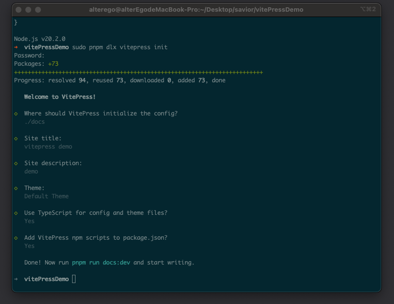
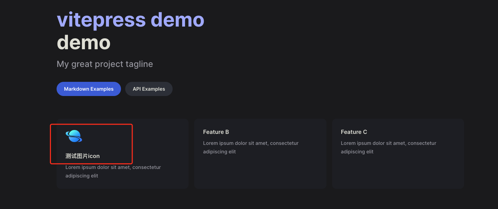
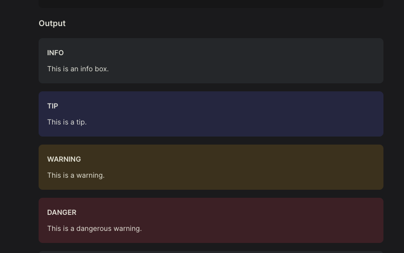
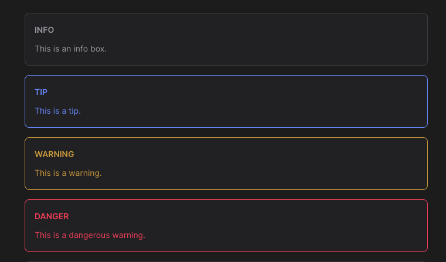
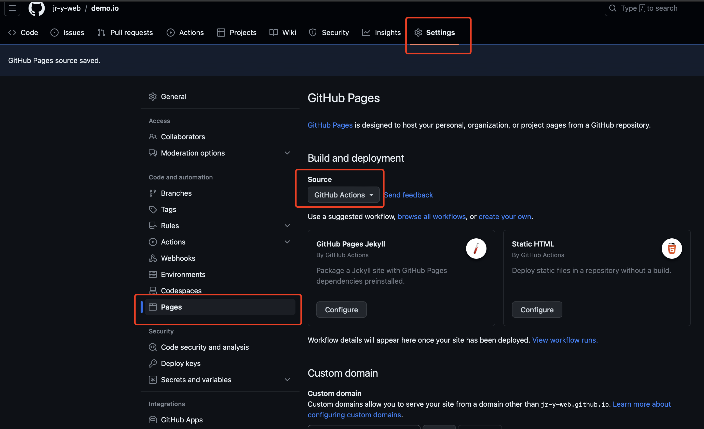
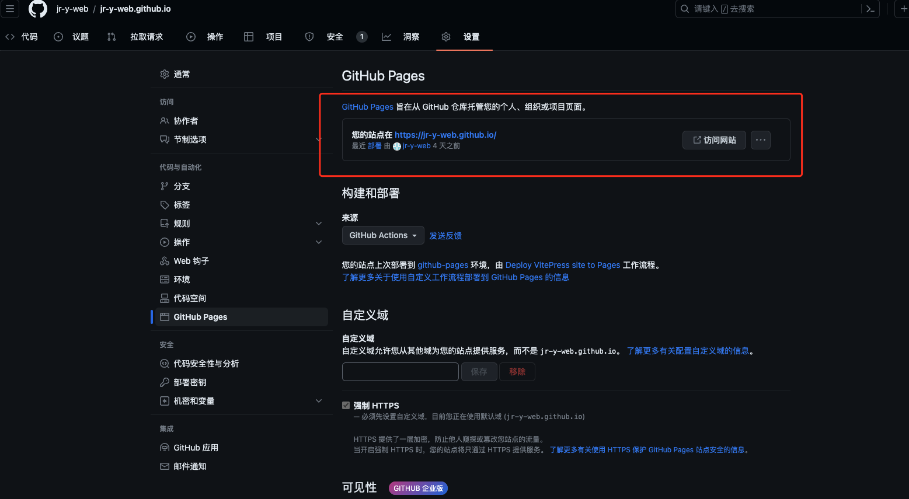

# VitePress 从下载到部署

什么是`VitePress`？ `VitePress` 是一个静态站点生成器 (SSG)，专为构建快速、以内容为中心的网站而设计。简而言之，`VitePress` 获取用 `Markdown` 编写的源内容，为其应用主题，并生成可以轻松部署在任何地方的静态 HTML 页面。

简单的说它是通过`Markdown`快速生成静态网站，你可以拿它来制作自己的博客和技术文档，比如`vite`和`pinia`等文档都是通过`VitePress`（还有非常多的技术文档，多的列举不过来），更难得是还可以通过`github Actions`**免费**的部署（白嫖就是香），而且过程相当的简单，甚至因为编写的是`Markdown`，整个过程不需要前端、后端、数据库等（当然需要稍微懂一点前端知识）就能完成一个技术博客。

> 个人技术博客，又有哪个程序不爱呢？

在安装之前，有几个必备的条件；

- Node.js 版本在 18 或者更高
- 需要一定的`Markdown`编写能力以及细微的前端知识

`VitePress`可以单独使用，也可以安装到现有项目中，这里以个人技术博客举例，创建一个全新的模版；

## 初始化

它自带一个类 Cli 的向导，可以通过这个快速完成配置(我这里使用`pnpm`,你也可以使用`cnpm`)：

```js
// pnpm 则为
pnpm dlx vitepress init

// npm | cnpm  则为
npx vitepress init
```

当输入后，它会简单的问了几个问题，分别为:

1. `where should VitePress initialze the chonfig?` vitepress 应该在哪里初始化配置? 这里强烈建议设定为官方默认的`./docs`, 后续`github Actions` 配置文件也会根据这个地址进行初始化，不然需要稍微折腾一下。
2. `Site title:` 站点标题
3. `Site description` 站点描述
4. `Theme:` 主题 （建议选择官方默认 `Default Theme`，官方提供了漂亮的黑色与白色模式）
5. `Use TypeScript for config and theme files?` 对配置文件和主题文件使用 TypeScript？ 推荐为 Yes，ts 简直不要太方便。
6. `Add VitePress npm scripts to package.json?` 是否将 VitePress npm 脚本添加到 package.json? Yes



然后进入到项目，找到`package.json`添加上`name`与`vitepress`包，后续`github Actions` 会使用，同时`cnpm i`全局安装依赖。

```json
// package.json
{
  "name": "blog",
  "version": "1.0.0",
  "type": "module",
  "devDependencies": {
    "vitepress": "1.0.0-rc.12"
  },
  "scripts": {
    "docs:dev": "vitepress dev docs",
    "docs:build": "vitepress build docs",
    "docs:preview": "vitepress preview docs"
  }
}
```

当完成上述后，只需要进入项目当中`pnpm run docs:dev`启动，你就能看到一个漂亮且简洁的`VitePress`模版。

### 文件结构

假设您选择在 `./docs` 中搭建 VitePress 项目，生成的文件结构应如下所示：

```
.
├─ docs
│  ├─ .vitepress
│  │  └─ config.ts
│  ├─ api-examples.md
│  ├─ markdown-examples.md
│  └─ index.md
└─ package.json
```

`docs` 目录被认为是 `VitePress` 站点的项目根。 `.vitepress` 目录是 `VitePress` 配置文件、开发服务器缓存、构建输出和可选主题自定义代码的保留位置。

其中，`api-examples.md`与`markdown-examples.md`为页面内容，`.vitePress/config.ts`为配置模块，`index.md`为首页。

## 首页配置

`vitePress` 的文档说的非常的详细，但一些坑点文档说的比较晦涩，难找。 所以特意列出了一些踩坑点供大家参考。

打开`index.md`，可以发现当前设置的首页标题，副标题等等都在这里，我们可以很简单易懂的编辑它，但这里存在一个坑吗，不容易被注意到。 `features`为首页最后的区块，这里的区块支持显示`icon`与`image`，我们可以根据文档说所的方式快速添加一个`icon`或者`image`，举个例子**假设现在有./docs/logo.png**;

```js
---
# https://vitepress.dev/reference/default-theme-home-page
layout: home

hero:
  name: "vitepress demo"
  text: "demo"
  tagline: My great project tagline
  actions:
    - theme: brand
      text: Markdown Examples
      link: /markdown-examples
    - theme: alt
      text: API Examples
      link: /api-examples

features:
  - title: 测试图片icon
    icon: { src: "./logo.png", alt: "测试图片" }
    details: Lorem ipsum dolor sit amet, consectetur adipiscing elit
  - title: Feature B
    details: Lorem ipsum dolor sit amet, consectetur adipiscing elit
  - title: Feature C
    details: Lorem ipsum dolor sit amet, consectetur adipiscing elit
---

```



在开发环境下，首页确实渲染了该图片，没有任何问题。 但如果我们使用部署模式查看的情况下，图片则会`404`；

```js
// 部署模式，先进行打包
cnpm run docs:dev

// 查看部署模式
cnpm run docs:preview

```

why? 官方文档有说明：

> 有时，您可能需要提供在任何 Markdown 或主题组件中未直接引用的静态资源，或者您可能希望使用原始文件名提供某些文件。此类文件的示例包括 robots.txt、favicons 和 PWA 图标。
> 您可以将这些文件放在源目录下的 public 目录中。例如，如果您的项目根目录是./docs 并使用默认源目录位置，那么您的公共目录将为./docs/public。
> 放置在 public 中的资源将按原样复制到输出目录的根目录。请注意，您应该使用根绝对路径引用放置在 public 中的文件 - 例如，public/icon.png 应始终在源代码中引用为/icon.png。

说明，当前博客的静态资源（图片、视频）等，都应该在站点下的`public`目录中，ok，现在把`logo.png`存放到`./docs/public`中 ,重新编译发现开发环境没有问题，再打包，编译部署模式查看，就可以发现图片能正常渲染。

这里除了图片之外，官方还很贴心的支持各种`Emoji`表情，比如现在搓一个 🤪，首页也会渲染成功，具体支持的列表可查看官方的[支持列表](https://github.com/markdown-it/markdown-it-emoji/blob/master/lib/data/full.json)。

```js
---
# https://vitepress.dev/reference/default-theme-home-page
layout: home

hero:
  name: "vitepress demo"
  text: "demo"
  tagline: My great project tagline
  actions:
    - theme: brand
      text: Markdown Examples
      link: /markdown-examples
    - theme: alt
      text: API Examples
      link: /api-examples

features:
  - title: 测试icon
    icon: 🤪
    details: Lorem ipsum dolor sit amet, consectetur adipiscing elit
  - title: Feature B
    details: Lorem ipsum dolor sit amet, consectetur adipiscing elit
  - title: Feature C
    details: Lorem ipsum dolor sit amet, consectetur adipiscing elit
---

```

## 配置文件

除了首页的配置（严谨应该说编写）是在`index.md`之外，绝大数的配置都在`./docs/.vitepress/config.ts`中， 重点是`themeConfig`对象，它是灵魂所在。如果刚初始化，呢么`themeConfig`则有`nav`与`sidebar`以及`socialLinks`。

### nav 导航链接

`nav`则是当前站点的顶部菜单，`text`是导航中显示的实际文本，`link`是单击文本时将导航到的链接。对于链接，将路径设置为实际文件的路径，不带`.md`前缀，并始终以`/`开头。

当然的，你也可以多重嵌套（比如说官方例子）：

```js
export default {
  themeConfig: {
    nav: [
      { text: "Guide", link: "/guide" },
      {
        text: "Dropdown Menu",
        items: [
          { text: "Item A", link: "/item-1" },
          { text: "Item B", link: "/item-2" },
          { text: "Item C", link: "/item-3" },
        ],
      },
    ],
  },
};
```

### sidebar 侧边栏

侧边栏是查看文档时候，处于左边的链接（如果你没有改布局的话）。

最简单的用法就是如此：

```js
    sidebar: [
      {
        text: 'Examples',
        items: [
          { text: 'Markdown Examples', link: '/markdown-examples' },
          { text: 'Runtime API Examples', link: '/api-examples' }
        ]
      }
    ],
```

当然，它还存在一个高阶的用法，在现实的情况中，往往需要是不同内容显示不同侧边栏，为此，首先将页面组织到每个所需部分的目录中(官方例子)：

```js
.
├─ guide/
│  ├─ index.md
│  ├─ one.md
│  └─ two.md
└─ config/
   ├─ index.md
   ├─ three.md
   └─ four.md
```

然后，更新您的配置以定义每个部分的侧边栏。这次，您应该传递一个对象而不是数组。

```js
export default {
  themeConfig: {
    sidebar: {
      // This sidebar gets displayed when a user
      // is on `guide` directory.
      "/guide/": [
        {
          text: "Guide",
          items: [
            { text: "Index", link: "/guide/" },
            { text: "One", link: "/guide/one" },
            { text: "Two", link: "/guide/two" },
          ],
        },
      ],

      // This sidebar gets displayed when a user
      // is on `config` directory.
      "/config/": [
        {
          text: "Config",
          items: [
            { text: "Index", link: "/config/" },
            { text: "Three", link: "/config/three" },
            { text: "Four", link: "/config/four" },
          ],
        },
      ],
    },
  },
};
```

### socialLinks 顶部右侧图标

为什么不把自己的 githuhb 贴出来呢？ `socialLinks` 为顶部右侧链接图标，通常链接到`github`等一些列你想要链接的地址。

## 站点 Logo

在首页中，一般还有一个`logo`（官方模版中没有把 logo 配置好，之前学习绕了一大圈才实现完整的效果），在你已经把`logo`的图片存放到`public`目录中后，回到`index.md`首页中，在`hero`添加`image`配置，这里拿我自己博客的配置举例：

```js
---
layout: home

hero:
  name: "zerone"
  text: "记录工作和学习中遇到的问题和get到的技能"
  tagline: 前端真实悲惨经历
  image:
    src: "../blogLogo.png"
    alt: "logo"
  actions:
    - theme: brand
      text: 进入笔记
      link: /serve/nodejs/index.md
    - theme: alt
      text: 关于我
      link: /about/me.md

features:
  - icon: ⚒️
    title: 前端开发
    details: 记录总结当前阶段前端学习的新技能和一些工作开发中遇到的问题
  - icon: 🛠️
    title: 后端开发
    details: 记录总结Node.js、Nest.js等后端的开发技术问题
  - icon: 🎮
    title: 兴趣分享
    details: 记录和分享一些游戏、书籍、电影、动漫等兴趣的爱好
---
```

顶部标题的`logo`也顺带安排上，打开`.vitepress/config.ts`，添加上` logo: '你图片的地址'`，ok，现在站点就有`logo`了。

## 打开搜索

搜索功能默认是关闭的,还是找到`config.ts`中的`defineConfig`,可以添加`search`对象，然后对其一些文本进行一些配置：

```js
export default defineConfig({
  // ..。省略
  // 搜索
  search: {
    provider: "local",
    options: {
      locales: {
        root: {
          translations: {
            button: {
              buttonText: "搜索文档",
              buttonAriaLabel: "搜索文档",
            },
            modal: {
              noResultsText: "无法找到相关结果",
              resetButtonTitle: "清除查询条件",
              footer: {
                selectText: "选择",
                navigateText: "切换",
              },
            },
          },
        },
      },
    },
  },

  // ..。省略
});
```

## 更改上一页 与 下一页 以及 右侧大纲文本

这里默认是英语，可以通过配置快速更改一下

```js
export default defineConfig({
  // ..。省略
  // 分页
  docFooter: {
    prev: "上一页",
    next: "下一页",
  },
  outlineTitle: "本页目录",
})``;
```

## 扩展样式

官方的主题样式，肯定有你不满的地方。 你可以使用自己定义的样式或者扩展其样式，扩展样式相对简单，首先创建一个样式文件，并且导出。

```js
// .vitepress/theme/index.js
import DefaultTheme from "vitepress/theme";
import "./custom.css";

export default DefaultTheme;
```

### 更改自定义容器样式

扩展也非常简单，写入对应想要更改的样式即可，自定义样式优先级比默认要高，举个例子，我不喜欢官方自定义容器的样式，一坨背景色,我想和`vitepress`中文文档样的自定义容器样式一样。



ok，我们找到对应样式直接覆盖（当然的，你可以更改对应的样式变量，我这里不想变动太多）

```js
    --vp-c-r-yellow: #f93;
    --vp-c-r-blue: #708fff;
    --vp-c-r-red: #f43f5e;

    .custom-block.warning {
      background: transparent;
      border-color:  var(--vp-c-r-yellow);
      color: var(--vp-c-r-yellow);
    }

    .custom-block.tip {
      background: transparent;
      border-color:  var(--vp-c-r-blue);
      color:  var(--vp-c-r-blue);
    }

    .custom-block.danger {
      background: transparent;
      border-color:  var(--vp-c-r-red);
      color: var(--vp-c-r-red);
    }
```



### 为 Logo 添加官方同款高斯模糊

可以看到`vite`等一些官方的`Logo`处会有一圈漂亮的模糊，这里官方是没有配置的，只能通过更改样式进行设置，通过控制台能很快找到包裹`Logo`的类与样式变量，我们可以快速对其进行修改：

```css
--vp-home-hero-name-color: transparent;
--vp-home-hero-name-background: -webkit-linear-gradient(
  120deg,
  #ed9e38,
  #2457f1
);
--vp-home-hero-image-background-image: linear-gradient(
  -45deg,
  #ed9e38 50%,
  #2457f1 50%
);
--vp-home-hero-image-filter: blur(72px);
```


## 部署到 github

“白嫖一时爽，一直白嫖一直爽！” `github`提供了`github pages`强大的功能让我们能部署静态站点。部署之前还需要确定一下以下几点，假设：

- `VitePress` 站点位于项目的 `docs` 目录内。 （你设定的站点为`./docs`）
- 正在使用默认的构建输出目录（`.vitepress/dist`）。 （打包输出目录）
- `VitePress` 作为本地依赖项安装在您的项目中，并且您已在 `package.json` 中设置了以下脚本：

```json
{
  "scripts": {
    "docs:build": "vitepress build docs",
    "docs:preview": "vitepress preview docs"
  }
}
```

- ` npm run docs:build` 以及 `npm run docs:preview` 查看页面并没有异常。
- 需要一个`github`账号

1. 当上述的条件都符合的情况下，去`github`创建一个仓库，仓库名称需要命名为**账号名.github.io**，**否则最终部署后路由地址将是<账号名.github.io/你写的地址>，会导致样式无法正常加载，当然可以通过配置文件进行解决，但如果不是同一账号下多个 github pages 站点，建议使用库名为账号名.github.io**，且库需要是公开（有钱可以氪金选择不公开）, **受不可抗力因素，github 会出现间隙性或者长时间无法登陆或者请求无法响应**，没有 xx 上网的情况下，只能硬等。 或者建议更换一些节点缓解这一类的情况。

2. 当创建库成功后，回到项目创建`.github/workflows/deploy.yml`，当然先把代码提交到库后在`github`上添加也行，不过碍于没有 xx 上网，先从本地创建是一个好办法。

该`yml`文件就是自动化脚本，它在提交代码后会自动打包部署到`github pages`，官方文档也有贴出给我们复制（不过你可能需要稍微改一下`yml`打包的方式），下面是我博客的`yml`配置，和官方唯一不同就是我指定了打包的形式为`yarn`，直接复制即可。

**特别需要强调，github 部署需要对应 yml 打包方式的版本控制文件，比如 npm | cnpm 的 package.lock.json , yarn 的 yarn.lock，如果代码库中没有这个文件将无法部署**

```yml
# Sample workflow for building and deploying a VitePress site to GitHub Pages
#
name: Deploy VitePress site to Pages

on:
  # Runs on pushes targeting the `main` branch. Change this to `master` if you're
  # using the `master` branch as the default branch.
  push:
    branches: [main]

  # Allows you to run this workflow manually from the Actions tab
  workflow_dispatch:

# Sets permissions of the GITHUB_TOKEN to allow deployment to GitHub Pages
permissions:
  contents: read
  pages: write
  id-token: write

# Allow only one concurrent deployment, skipping runs queued between the run in-progress and latest queued.
# However, do NOT cancel in-progress runs as we want to allow these production deployments to complete.
concurrency:
  group: pages
  cancel-in-progress: false

jobs:
  # Build job
  build:
    runs-on: ubuntu-latest
    steps:
      - name: Checkout
        uses: actions/checkout@v3
        with:
          fetch-depth: 0 # Not needed if lastUpdated is not enabled
      # - uses: pnpm/action-setup@v2 # Uncomment this if you're using pnpm
      - name: Setup Node
        uses: actions/setup-node@v3
        with:
          node-version: 18
          cache: yarn
      - name: Setup Pages
        uses: actions/configure-pages@v3
      - name: Install dependencies
        run: yarn install
      - name: Build with VitePress
        run: yarn docs:build
      - name: Upload artifact
        uses: actions/upload-pages-artifact@v2
        with:
          path: docs/.vitepress/dist

  # Deployment job
  deploy:
    environment:
      name: github-pages
      url: ${{ steps.deployment.outputs.page_url }}
    needs: build
    runs-on: ubuntu-latest
    name: Deploy
    steps:
      - name: Deploy to GitHub Pages
        id: deployment
        uses: actions/deploy-pages@v2
```

3. 初始化`git`，提交代码

ok，剩下就是正常提交代码去`git`了，我们指定线上为`main`分支（更改的话，你需要对应去更改`yml`文件），建议使用命令方式提交，**没有 xx 上网的情况下，可视化工具一般无法提交成功，我自己用 sourcetree 就没有成功过一次，反而命令能偶尔成功提交**。

```js
git init
git add README.md
git commit -m "first commit"
git branch -M main
git remote add origin git库地址
git push -u origin main
```

当一切都提交好后，登陆`github`查看是否提交完成。

4. 设置`github pages`

在`github`菜单中点击`settings` --> `pages` , 我们选择`github Actions`即可。



ok，再让我们触发一次提交。

当提交成功后，可以去顶部菜单`Actions`查看这次部署是否成功，如果报错的情况，它会提供相应的报错信息，如果没有报错，点击顶部菜单`settings`，然后侧边栏`pages`，它将在几秒中后部署完成，并且输出你站点的地址。



那剩下的就是自己的创作空间了，**每次提交推送成功后，github pages 会自动部署，并且部署后地址不会受到来自不可抗力的 DNS 污染，讲人话就是能丝滑浏览**，博客就此初始化完成，后续只需要结合官方文档就可以做一下不一样的配置。

[官方文档](https://vitepress.dev/)

[第三方翻译的中文文档](https://vitepress.qzxdp.cn/)

---

如果你按流程也成功创建了自己的博客，不如给我的`github`打一个`stars`🤪? 在工作不忙的情况下也会偶尔分享一些自己的兴趣爱好，和前端学习笔记~~真实的挣扎经历~~。

[git 地址](https://github.com/jr-y-web/jr-y-web.github.io)

[博客](https://jr-y-web.github.io/)
