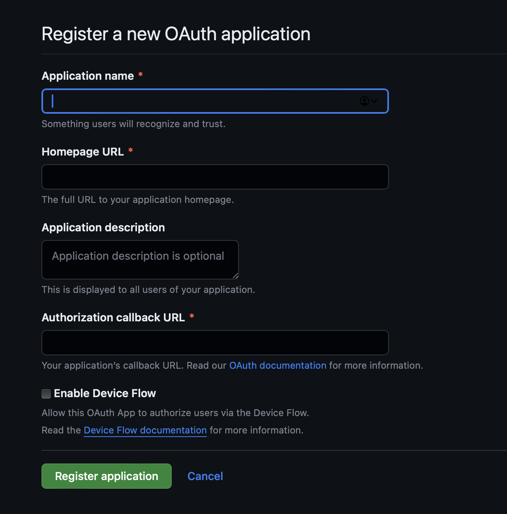
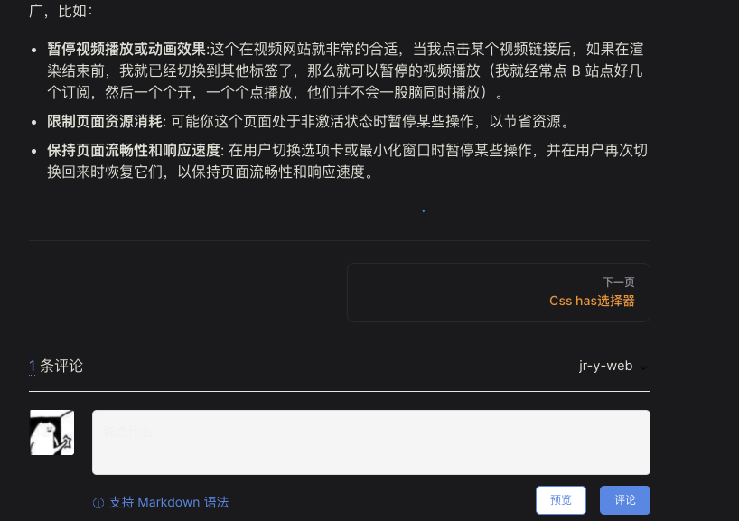
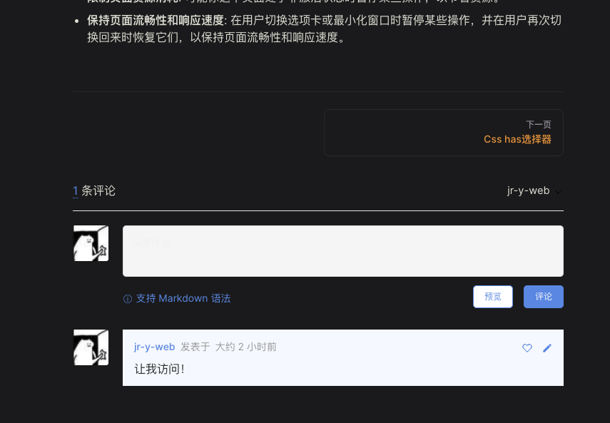

# 我必须立马评论！为 VitePress 添加评论功能

之前有写过如何通过[`VitePress`快速搭建个人博客](https://jr-y-web.github.io/web/skill/visibilitystate.html)有兴趣可以阅读，目前如果要读者之间或者读者与作者的交流，无外乎：

- 你留下了联系方式，比如加群等方式
- 去`github`的`issuse`进行讨论
- 摆烂，大家意念交流

所以没有“评论”系统的功能，对于博客这种类型的站点来说是一个不完美的项目。 那既然没有“评论”功能，搓一个不就完事了么？ 但据规则，个人网站不允许制作论坛、评论、博客、聊天、留言板等互动页面。一旦发现，该记录号将被直接屏蔽。 而且本身如果你的站点为静态的站点，举个例子比如我的博客基于`github`静态部署的`vitepress`还需要进行一番改造才能获取远端数据，同时你需要申请域名，以及备案等。

那有什么办法可以减少这系列繁杂的操作？

## 解决方案

原理也非常简单，我们把`issuse`当成评论模块功能即可，这里使用来自`github`里面的开源[`gitalk`](https://github.com/gitalk/gitalk)进行实现该功能。

### gitalk 是什么？

`Gitalk` 是一个基于 `GitHub Issue` 和 `Preact` 开发的评论插件。

它具有以下特性

- 使用 `GitHub` 登录
- 支持多语言 [`en`, `zh-CN`, `es-ES`, `fr`, `ru`]
- 支持个人或组织
- 无干扰模式（设置 `distractionFreeMode` 为 true 开启）
- 快捷键提交评论 （`cmd|ctrl + enter`）

为啥不用其他评论插件？ 国外还有其他插件，比如说`Disqua`，但一般来说服务器都架在国外，而且访问速度等一系列问题，所以折腾起来并不容易。 国内其实有多说、友言等，当国内的一般可以支持`微信`、`QQ`等登录，变相降低了评论门槛，导致了一些素质较低的键盘侠随意登录评论...你懂得。毕竟你也不想天天清理`Issue`吧。

所以选择了 `Gitalk`, 它限制了只有 `GitHub` 用户才能登录评论！

### 集成到 vitePress

集成之前，需要去`github`获取一下`clientID`与`clientSecret`，登录`github`先申请 `GitHub Application`， [https://github.com/settings/applications/new](https://github.com/settings/applications/new)。



有三个必填项:

- Application name 名称
- Homepage URL 你博客的地址
- Authorization callback URL 如果有其他地址写上就好，没有则和 Homepage URL 一样即可。

填写完后点击`Register application`，就会进入到下面的页面，这里一定一定一定，我说的是一定！！创建完后一定要复制和保存好`Client ID`与`Client secrets`，`Client secrets`刷新一下就会进入隐藏模式，你想看就需要折腾了。

保存你的 `Client ID` 和 `secret`，后面会用到。

再去创建一个新的 `github` 仓库，用来存储评论。

老一套，选择你喜欢的安装方式

```bash
pnpm i gitalk
```

因为嵌入了评论结构，需要稍微往模版上添加`DOM`结构。 创建文件夹`.vitepress/theme/layout`，然后通过生命周期插入`DOM`即可（当然你可以引入组件，我这是少折腾，后期想加其他模块再改）,同时`import gitalk`，配置一下参数。

```vue
<template>
  <Layout />
</template>

<script setup>
import DefaultTheme from "vitepress/theme";
const { Layout } = DefaultTheme;
import { watch, nextTick, onMounted } from "vue";
import "gitalk/dist/gitalk.css";
import Gitalk from "gitalk";
import { useRouter } from "vitepress";

let { route } = useRouter(); // 页面路由对象

onMounted(() => {
    watch(
        () => route.path, // 监听路由变化，重新挂载评论组件
        () => {
            nextTick(() => {
                if (typeof window !== undefined) {
                    const content_div = document.querySelector(".content-container"); // 查找页面内容DOM节点，此节点只有layout为Page（默认layout属性）的md文档才有
                    if (content_div) {
                        const before_s_div = document.getElementById("gitalk-page-container") // 获取页面评论组件DOM节点
                        if (before_s_div) {  //判断是否已有评论组件节点，有则删除，重新创建。
                            content_div.removeChild(before_s_div)
                        }
                        const s_div = document.createElement("div"); // 创建节点
                        s_div.setAttribute("id", "gitalk-page-container"); // 设置id
                        content_div.appendChild(s_div); // querySelector的节点可自己根据自己想加载的地方设置
                        const gitment = new Gitalk({
                          github_access_token',
                            id: route.data.title, // 可选，推荐设置为页面标题，因为会作为标签传给Github issues，且issues标签有长度限制。
                            owner: "xxxx", // GitHub repository 所有者
                            repo: "上文叫你创建用来存储用户评论的仓库名", // GitHub repositor
                            clientID: "*******", // 自己的clientID
                            clientSecret: ""*******",", // 自己的clientSecret
                            admin: ["github用户名"], // GitHub repository 所有者
                            labels: ["Gitalk"], // GitHub issue 的标签
                            createIssueManually: true, //如果当前页面没有相应的 isssue 且登录的用户属于 admin，则会自动创建 issue。如果设置为 true，则显示一个初始化页面，创建 issue 需要点击 init 按钮。
                        });
                        gitment.render("gitalk-page-container");
                    }
                }
            })
        },
        { immediate: true }
    );
});
</script>
```

ok，重新编译，你就能发现评论功能成功嵌入其中。



## 代理

相信你已经尝试过了。 当点击登录的时候，发现它调的`github API`接口 404 报错了。 嗯...不用多想就是我们最为熟悉的原因。

这里有几个办法：

- **XX**上网
- 代理
- 摆烂，放弃写评论功能

飞机上网不太现实，我们都实现了博客可以白嫖`github`，做到国内可以访问。 如果回到了需要 XX 上网,那不如前后开发是吧。 同时也不能指望人人都可以开飞机。

~~那么，答案只有一个了 bushi~~那么，只能寻求代理了，代理这方面可以参考社区一位顶级大佬的方案。

[解决 Gitalk 无法获取 Github Token 问题](https://prohibitorum.top/7cc2c97a15b4.html)

这篇文章里讲述了前因后果，感谢这位作者，然后我们可以直接使用博主提供地址，或者将这个 `repo` 直接 `fork` 到自己的 `github` 中，在 `vercel` 或 `netify` 上进行部署，将 `url` 后面加上 /`github_access_token` 填入到我们上面的 `proxy` 中，就可以进行使用了。

或者你可以按照文章作者所说的直接用他的即可： `https://vercel.prohibitorum.top/github_access_token`。

ok,我们回到对`gitalk`配置逻辑中，新增`proxy`字段。

```vue
<template>
  <Layout />
</template>

<script setup>
import DefaultTheme from "vitepress/theme";
const { Layout } = DefaultTheme;
import { watch, nextTick, onMounted } from "vue";
import "gitalk/dist/gitalk.css";
import Gitalk from "gitalk";
import { useRouter } from "vitepress";

let { route } = useRouter(); // 页面路由对象

onMounted(() => {
    watch(
        () => route.path, // 监听路由变化，重新挂载评论组件
        () => {
            nextTick(() => {
                if (typeof window !== undefined) {
                    const content_div = document.querySelector(".content-container"); // 查找页面内容DOM节点，此节点只有layout为Page（默认layout属性）的md文档才有
                    if (content_div) {
                        const before_s_div = document.getElementById("gitalk-page-container") // 获取页面评论组件DOM节点
                        if (before_s_div) {  //判断是否已有评论组件节点，有则删除，重新创建。
                            content_div.removeChild(before_s_div)
                        }
                        const s_div = document.createElement("div"); // 创建节点
                        s_div.setAttribute("id", "gitalk-page-container"); // 设置id
                        content_div.appendChild(s_div); // querySelector的节点可自己根据自己想加载的地方设置
                        const gitment = new Gitalk({
                            proxy: 'https://vercel.prohibitorum.top/github_access_token',  // 代理
                            id: route.data.title, // 可选，推荐设置为页面标题，因为会作为标签传给Github issues，且issues标签有长度限制。
                            owner: "xxxx", // GitHub repository 所有者
                            repo: "上文叫你创建用来存储用户评论的仓库名", // GitHub repositor
                            clientID: "*******", // 自己的clientID
                            clientSecret: ""*******",", // 自己的clientSecret
                            admin: ["github用户名"], // GitHub repository 所有者
                            labels: ["Gitalk"], // GitHub issue 的标签
                            createIssueManually: true, //如果当前页面没有相应的 isssue 且登录的用户属于 admin，则会自动创建 issue。如果设置为 true，则显示一个初始化页面，创建 issue 需要点击 init 按钮。
                        });
                        gitment.render("gitalk-page-container");
                    }
                }
            })
        },
        { immediate: true }
    );
});
</script>
```

让我们重新登录评论，结果正常，现在就能成功写入到`issuse`，并且在页面渲染评论功能！




## 一些常见的问题

F: 当`vitePress`切换到深色模式的时候，评论的编辑框输入字体为白色，该怎么处理？

Q：使用`vitepress`自定义样式改一下冲突的地方，包括它`:hover`的效果，我的审美接受不了，当然或许你可以。

---

F: 评论区域显示： 未找到相关的 `Issues` 进行评论请联系 xx 初始化创建。

Q: 作者需要先初始化`Issue`才能让其他人进行评论，所以你需要一个个点... ， 所以评论功能要早做啊，淦，我那么多页面。

---

F：调试点击登录会跳到正式地址，如何保持原有的`localhost`进行登录返回？
Q: 回到[https://github.com/settings/applications/2374501](https://github.com/settings/applications/2374501)，把地址更改为本地。 当然重新部署的时候记得设置回去！
